## Processes and Threads

操作系统会为该应用程序创建一个进程。作为一个应用程序，它像一个为所有资源而运行的容器。这些资源包括内存地址空间、文件句柄、设备和线程。

线程是操作系统调度的一种执行路径，用于在处理器执行我们在函数中编写的代码。一个进程从一个线程开始，即主线程，当该线程终止时，进程终止。这是因为主线程是应用程序的原点。然后，主线程可以依次启动更多的线程，而这些线程可以启动更多的线程。

无论线程属于哪个进程，操作系统都会安排线程在可用处理器上运行。每个操作系统都有自己的算法来做出这些决定。


## Goroutines and Parallelism

o 语言层面支持的 go 关键字，可以快速的让一个函数创建为 goroutine，我们可以认为 main 函数就是作为 goroutine 执行的。操作系统调度线程在可用处理器上运行，Go运行时调度 goroutine 在绑定到单个操作系统线程的逻辑处理器中运行（P）。即使使用这个单一的逻辑处理器和操作系统线程，也可以调度数十万 goroutine 以惊人的效率和性能并发运行。

### Concurrency is not Parallelism.

并发不是并行。并行是指两个或多个线程同时在不同的处理器执行代码。如果将运行时配置为使用多个逻辑处理器，则调度程序将在这些逻辑处理器之间分配 goroutine，这将导致 goroutine 在不同的操作系统线程上运行。但是，要获得真正的并行性，您需要在具有多个物理处理器的计算机上运行程序。否则，goroutine 将针对单个物理处理器并发运行，即使 Go 运行时使用多个逻辑处理器。

## Keep yourself busy or do the work yourself

空的 select 语句将永远阻塞。

```go
package main

import (
	"fmt"
	"log"
	"net/http"
)

func main() {
	http.HandleFunc("/", func(w http.ResponseWriter, r *http.Request) {
		fmt.Fprintln(w, "Hello")
	})
	go func() {
		// 监听 8282 端口
		if err := http.ListenAndServe(":8282", nil); err != nil {
			log.Fatal(err)
		}
	}()
	// 空的 select 语句将永远阻塞。
	select {}
}
```


如果你的 goroutine 在从另一个 goroutine 获得结果之前无法取得进展，那么通常情况下，你自己去做这项工作比委托它( go func() )更简单。

**这通常消除了将结果从 goroutine 返回到其启动器所需的大量状态跟踪和 chan 操作。**

```go
package main

import (
	"fmt"
	"log"
	"net/http"
)

func main() {
	http.HandleFunc("/", func(w http.ResponseWriter, r *http.Request) {
		fmt.Fprintln(w, "Hello Golang")
	})
	// 监听 8282 端口
	if err := http.ListenAndServe(":8282", nil); err != nil {
		log.Fatal(err)
	}
}

```

## Leave concurrency to the caller

将并发性留给调用者


下面两个 API 有什么区别？

```go
// ListDirectory returns the contents of dir.
func ListDirectory(dir string) ([]string, error)

// ListDirectory returns a channel over which
// directory entries will be published. When the list
// of entries is exhausted, the channel will be closed.
func ListDirectory(dir string) chan string
```

第一个API：

将目录读取到一个 slice 中，然后返回整个切片，或者如果出现错误，则返回错误。这是同步调用的，ListDirectory 的调用方会阻塞，直到读取所有目录条目。根据目录的大小，这可能需要很长时间，并且可能会分配大量内存来构建目录条目名称的 slice。

第二个 API：

ListDirectory 返回一个 chan string，将通过该 chan 传递目录。当通道关闭时，这表示不再有目录。由于在 ListDirectory 返回后发生通道的填充，ListDirectory 可能内部启动 goroutine 来填充通道。

###ListDirectory chan 版本还有两个问题：

通过使用一个关闭的通道作为不再需要处理的项目的信号，ListDirectory 无法告诉调用者通过通道返回的项目集不完整，因为中途遇到了错误。调用方无法区分空目录与完全从目录读取的错误之间的区别。这两种方法都会导致从 ListDirectory 返回的通道会立即关闭。

调用者必须持续从通道读取，直到它关闭，因为这是调用者知道填充 chan 的 goroutine 已经停止的唯一方法。这对 ListDirectory 的使用是一个严重的限制，调用者必须花时间从通道读取数据，即使它可能已经收到了它想要的答案。对于大中型目录，它可能在内存使用方面更为高效，但这种方法并不比原始的基于 slice 的方法快。

以上两种API实现所带来的的问题的解决方案是使用回调函数，该回调是在执行时在每个目录条目的上下文中调用函数。

```go
func ListDirectory(dir string, fn func(string))
```

filepath.WalkDir 就是使用这种方式实现的，如果函数启动 goroutine，则必须向调用方提供显式停止该goroutine 的方法。通常，将异步执行函数的决定权交给该函数的调用方通常更容易。

贴士: 如果你的函数启动了 `goroutine`，你必须为调用者提供一种明确停止 `goroutine` 的方法。 把异步执行函数的决定留给该函数的调用者通常会更容易些。

## Never start a goroutine without knowning when it will stop

每次`go` 在程序中使用关键字启动 goroutine 时，您必须知道该 goroutine 将如何以及何时退出。如果您不知道答案，那就是潜在的内存泄漏。

生产代码中的 goroutine 泄漏通常更难找到。也无法说明 goroutine 泄漏可能发生的所有可能方式。

您可能会遇到以下代码片段：

```go
package main

import "fmt"

func main() {
	// 本实例存在内存的泄露，因为无法知道chan什么时候关闭
	ch := make(chan int)
	go func() {
		val := <-ch
		fmt.Println("收到一个值：", val)
	}()
}

```

Any time you start a Goroutine you must ask yourself:

- When will it terminate?

- What could prevent it from terminating?


这个简单的应用程序在两个不同的端口上提供 http 流量，端口8080用于应用程序流量，端口8001用于访问 /debug/pprof 端点。

```go
package main

import (
	"fmt"
	"net/http"
	_ "net/http/pprof"
)

func main() {
	// http.NewServeMux()的作用是注册网络访问的多路路由
	mux := http.NewServeMux()
	mux.HandleFunc("/", func(resp http.ResponseWriter, req *http.Request) {
		fmt.Fprintln(resp, "Hello")
	})
	// 用于访问 127.0.0.1:8001/debug/pprof 端点
	go http.ListenAndServe("127.0.0.1:8001", http.DefaultServeMux)
	http.ListenAndServe("0.0.0.0:8080", mux)
}
```

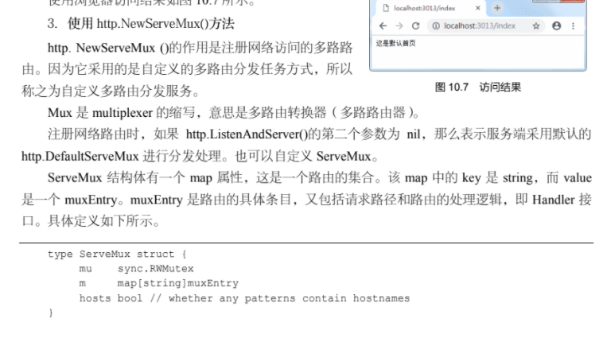

通过将 serveApp 和 serveDebug 处理程序分解为各自的函数，我们将它们与 main.main 解耦，我们还遵循了上面的建议，并确保 serveApp 和 serveDebug 将它们的并发性留给调用者。

如果 serveApp 返回，则 main.main 将返回导致程序关闭，只能靠类似 supervisor 进程管理来重新启动。

```go
package main

import (
	"fmt"
	"net/http"
	_ "net/http/pprof"
)

func serveApp() {
	mux := http.NewServeMux()
	mux.HandleFunc("/", func(resp http.ResponseWriter, req *http.Request) {
		fmt.Fprintln(resp, "Hello Mai")
	})
	http.ListenAndServe("0.0.0.0:8080", mux)
}

func serveDebug() {
	// 用于访问 127.0.0.1:8001/debug/pprof 端点
	http.ListenAndServe("127.0.0.1:8001", http.DefaultServeMux)
}

func main() {
	go serveApp()
	serveDebug()
}
```

然而，serveDebug 是在一个单独的 goroutine 中运行的，如果它返回，那么所在的 goroutine 将退出，而程序的其余部分继续运行。

由于 /debug 处理程序很久以前就停止工作了，所以会很不高兴地发现他们无法在需要时从您的应用程序中获取统计信息。

ListenAndServer 返回 nil error，最终 main.main 无法退出。log.Fatal 调用了 os.Exit，会无条件终止程序；defer 不会被调用到。

```go
package main

import (
	"fmt"
	"log"
	"net/http"
	_ "net/http/pprof"
)

func serveApp() {
	mux := http.NewServeMux()
	mux.HandleFunc("/", func(resp http.ResponseWriter, req *http.Request) {
		fmt.Fprintln(resp, "Hello Mai")
	})
	if err := http.ListenAndServe("0.0.0.0:8080", mux); err != nil {
		log.Fatal(err)
	}

}

func serveDebug() {
	// 用于访问 127.0.0.1:8001/debug/pprof 端点
	if err := http.ListenAndServe("127.0.0.1:8001", http.DefaultServeMux); err != nil {
		log.Fatal()
	}
}

func main() {
	go serveApp()
	go serveDebug()
	select {}
}

```

**Only use log.Fatal from main.main or init functions. **

log.Fatal应该仅在main或init函数中使用(或者可能在某些只能直接从它们调用的函数中使用).

Never start a goroutine without knowning when it will stop

https://github.com/da440dil/go-workgroup

```go
package main

import (
	"context"
	"fmt"
	"net/http"
	_ "net/http/pprof"
)

func serve(addr string, handler http.Handler, stop <-chan struct{}) error {
	s := http.Server{
		Addr:    addr,
		Handler: handler,
	}
	go func() {
		// wait for signal
		<-stop
		s.Shutdown(context.Background())
	}()
	return s.ListenAndServe()
}
func serveApp(stop <-chan struct{}) error {
	mux := http.NewServeMux()
	mux.HandleFunc("/", func(resp http.ResponseWriter, req *http.Request) {
		fmt.Fprintln(resp, "Hello Mai")
	})
	return serve("0.0.0.0:8080", mux, stop)
}

func serveDebug(stop <-chan struct{}) error {
	return serve("127.0.0.1:8001", http.DefaultServeMux, stop)
}

func main() {
	done := make(chan error, 2)
	stop := make(chan struct{})
	go func() {
		done <- serveDebug(stop)
	}()
	go func() {

		done <- serveApp(stop)
	}()
	var stoped bool
	for i := 0; i < cap(done); i++ {
		if err := <-done; err != nil {
			fmt.Printf("error:%v\n", err)
		}
		if !stoped {
			stoped = true
			close(stop)
		}
	}
}

```

## Application Lifecycle

无法保证创建的 goroutine 生命周期管理，会导致最常见的问题，就是在服务关闭时候，有一些事件丢失。

```go
package main

import (
	"log"
	"net/http"
	"time"
)

type Tracker struct {
}

func (t *Tracker) Event(data string) {
	time.Sleep(time.Millisecond)
	log.Println(data)
}

type App struct {
	tracker Tracker
}

func (a *App) Handle(w http.ResponseWriter, r *http.Request) {
	w.WriteHeader(http.StatusCreated)
	// bug 没有管理这个goroutine
	go a.tracker.Event("this event")
}
```

使用 sync.WaitGroup 来追踪每一个创建的 goroutine。

```go
package main

import (
	"log"
	"net/http"
	"sync"
	"time"
)

type Tracker struct {
	wg sync.WaitGroup
}

func (t *Tracker) Event(data string) {
	t.wg.Add(1)
	go func() {
		defer t.wg.Done()
		time.Sleep(time.Millisecond)
		log.Println(data)
	}()
}

func (t *Tracker) Shutdown() {
	t.wg.Wait()
}

type App struct {
	tracker Tracker
}

func (a *App) Handle(w http.ResponseWriter, r *http.Request) {
	w.WriteHeader(http.StatusCreated)
	// bug 没有管理这个goroutine
	go a.tracker.Event("this event")
}

func main() {
	var app App
	// 等待所有 event groutine
	app.tracker.Shutdown()
}
```

将 wg.Wait() 操作托管到其他 goroutine，owner goroutine 使用 context 处理超时。仍然不喜欢这个 demo，大量创建goroutine 来处理任务，代价高。

```go
package main

import (
	"context"
	"errors"
	"fmt"
	"log"
	"net/http"
	"sync"
	"time"
)

type Tracker struct {
	wg sync.WaitGroup
}

func (t *Tracker) Event(data string) {
	t.wg.Add(1)
	go func() {
		defer t.wg.Done()
		time.Sleep(time.Millisecond)
		log.Println(data)
	}()
}

func (t *Tracker) Shutdown(ctx context.Context) error {
	ch := make(chan struct{})
	go func() {
		t.wg.Wait()
		close(ch)
	}()
	select {
	case <-ch:
		return nil
	case <-ctx.Done():
		return errors.New("Timeout")
	}

}

type App struct {
	tracker Tracker
}

func (a *App) Handle(w http.ResponseWriter, r *http.Request) {
	w.WriteHeader(http.StatusCreated)
	// bug 没有管理这个goroutine
	go a.tracker.Event("this event")
}

func main() {
	const timeout = 5 * time.Second
	ctx, cancel := context.WithTimeout(context.Background(), timeout)
	defer cancel()

	var app App
	// 等待所有 event groutine
	err := app.tracker.Shutdown(ctx)
	fmt.Println(err)
}

```


## Memory model 内存模型

https://golang.org/ref/mem

如何保证在一个 goroutine 中看到在另一个 goroutine 修改的变量的值，如果程序中修改数据时有其他 goroutine 同时读取，那么必须将读取串行化。为了串行化访问，请使用 channel 或其他同步原语，例如 sync 和 sync/atomic 来保护数据。

### Happen-Before

在一个 goroutine 中，读和写一定是按照程序中的顺序执行的。即编译器和处理器只有在不会改变这个 goroutine 的行为时才可能修改读和写的执行顺序。由于重排，不同的 goroutine 可能会看到不同的执行顺序。例如，一个goroutine 执行 a = 1;b = 2;，另一个 goroutine 可能看到 b 在 a 之前更新。

### Memory Reordering 内存重排

用户写下的代码，先要编译成汇编代码，也就是各种指令，包括读写内存的指令。CPU 的设计者们，为了榨干 CPU 的性能，无所不用其极，各种手段都用上了，你可能听过不少，像流水线、分支预测等等。其中，为了提高读写内存的效率，会对读写指令进行重新排列，这就是所谓的内存重排，英文为 MemoryReordering。

这一部分说的是 CPU 重排，其实还有编译器重排。比如: 

```go
x := 0
for i := 0; i < 100; i++ {
    x = 1
    println(x)
}

// 重排后
x := 1
for i := 0; i < 100; i++ {
    println(x)
}
```

但是，如果这时有另外一个线程同时干了这么一件事：`x=0`

在多核心场景下，没有办法轻易地判断两段程序是“等价”的。

现代 CPU 为了“抚平” 内核、内存、硬盘之间的速度差异，搞出了各种策略，例如三级缓存等。为了让 (2) 不必等待 (1) 的执行“效果”可见之后才能执行，我们可以把 (1) 的效果保存到 store buffer

store buffer 对单线程是完美的.

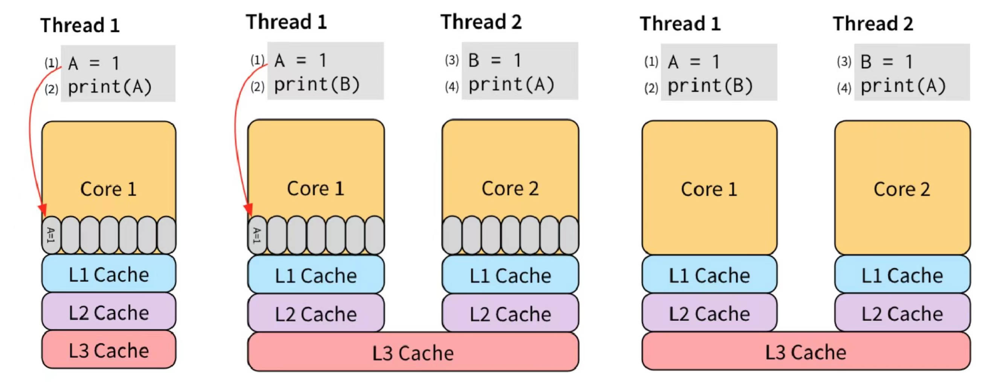

先执行 (1) 和 (3)，将他们直接写入 store buffer，接着执行 (2) 和 (4)。“奇迹”要发生了：(2) 看了下 store buffer，并没有发现有 B 的值，于是从 Memory 读出了 0，(4) 同样从 Memory 读出了 0。最后，打印出了 00。


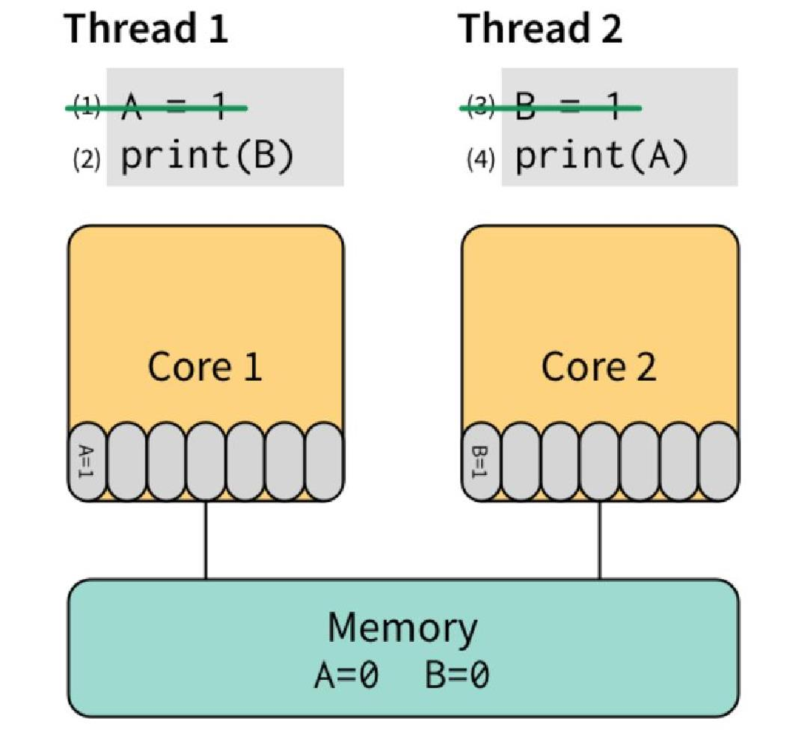

因此，对于多线程的程序，所有的 CPU 都会提供“锁”支持，称之为 barrier，或者 fence。它要求：barrier 指令要求所有对内存的操作都必须要“扩散”到 memory 之后才能继续执行其他对 memory 的操作。因此，我们可以用高级点的 atomic compare-and-swap，或者直接用更高级的锁，通常是标准库提供。

为了说明读和写的必要条件，我们定义了先行发生（Happens Before）。如果事件 e1 发生在 e2 前，我们可以说 e2 发生在 e1 后。如果 e1不发生在 e2 前也不发生在 e2 后，我们就说 e1 和 e2 是并发的。

**在单一的独立的 goroutine 中先行发生的顺序即是程序中表达的顺序。**

当下面条件满足时，对变量 v 的读操作 r 是被允许看到对 v 的写操作 w 的：

- r 不先行发生于 w
- 在 w 后 r 前没有对 v 的其他写操作

为了保证对变量 v 的读操作 r 看到对 v 的写操作 w，要确保 w 是 r 允许看到的唯一写操作。即当下面条件满足时，r 被保证看到 w：

- w 先行发生于 r
- 其他对共享变量 v 的写操作要么在 w 前，要么在 r 后。

**这一对条件比前面的条件更严格，需要没有其他写操作与 w 或 r 并发发生。**

单个 goroutine 中没有并发，所以上面两个定义是相同的：

读操作 r 看到最近一次的写操作 w 写入 v 的值。

当多个 goroutine 访问共享变量 v 时，它们必须使用同步事件来建立先行发生这一条件来保证读操作能看到需要的写操作。 

- 对变量 v 的零值初始化在内存模型中表现的与写操作相同。
- 对大于 single machine word 的变量的读写操作表现的像以不确定顺序对多个 single machine word 的变量的操作。

推荐阅读：https://www.jianshu.com/p/5e44168f47a3


## Package sync 同步包

### Share Memory By Communicating 通过通信共享内存

传统的线程模型（通常在编写 Java、C++ 和Python 程序时使用）程序员在线程之间通信需要使用共享内存。通常，共享数据结构由锁保护，线程将争用这些锁来访问数据。在某些情况下，通过使用线程安全的数据结构（如 Python 的Queue），这会变得更容易。

Go 的并发原语 goroutines 和 channels 为构造并发软件提供了一种优雅而独特的方法。Go 没有显式地使用锁来协调对共享数据的访问，而是鼓励使用 chan 在 goroutine 之间传递对数据的引用。这种方法确保在给定的时间只有一个 goroutine 可以访问数据。

Do not communicate by sharing memory; instead, share memory by communicating.

不要通过共享内存进行通信；相反，通过通信共享内存。

### Detecting Race Conditions With Go

data race 是两个或多个 goroutine 访问同一个资源（如变量或数据结构），并尝试对该资源进行读写而不考虑其他 goroutine。这种类型的代码可以创建您见过的最疯狂和最随机的 bug。通常需要大量的日志记录和运气才能找到这些类型的bug。

早在6月份的 Go 1.1中，Go 工具引入了一个 race detector。竞争检测器是在构建过程中内置到程序中的代码。然后，一旦你的程序运行，它就能够检测并报告它发现的任何竞争条件。它非常酷，并且在识别罪魁祸首的代码方面做了令人难以置信的工作。

```go
// 竞争检测
go build -race
go test -race
```

```go
package main

import (
	"fmt"
	"sync"
)

var Wait sync.WaitGroup
var Counter int = 0

func Routine(id int) {
	for count := 0; count < 2; count++ {
		value := Counter
		value++
		Counter = value
	}
	Wait.Done()
}

func main() {
	for routine := 1; routine <= 2; routine++ {
		Wait.Add(1)
		go Routine(routine)
	}
	Wait.Wait()
	fmt.Printf("最后的Counter:%d\n", Counter)
}
// 最后的Counter:4
```

使用`go build -race race.go`，输出以下结果：

```go
==================
WARNING: DATA RACE
Read at 0x000001002e90 by goroutine 8:
  main.Routine()
      D:/myproject/race.go:13 +0x4e

Previous write at 0x000001002e90 by goroutine 7:
  main.Routine()
      D:/myproject/race.go:15 +0x6a

Goroutine 8 (running) created at:
  main.main()
      D:/myproject/race.go:23 +0x7c

Goroutine 7 (finished) created at:
  main.main()
      D:/myproject/race.go:23 +0x7c
==================
最后的Counter:4
```

第13行: value := Counter
第15行: Counter = value
第23行: go Routine(routine)

这个命令输出了Warning，告诉我们，goroutine8运行到第13行和goroutine 7运行到15行的时候触发竞争了。
而且goroutine8是在第23行的时候产生的。

这样我们根据分析这个提示就可以看到这个程序在哪个地方写的有问题了。

当然这个参数会引发CPU和内存的使用增加，所以基本是在测试环境使用，不是在正式环境开启。


工具似乎检测到代码的争用条件。如果您查看race condition 报告下面，您可以看到程序的输出: 全局计数器变量的值为 2 或者 4。

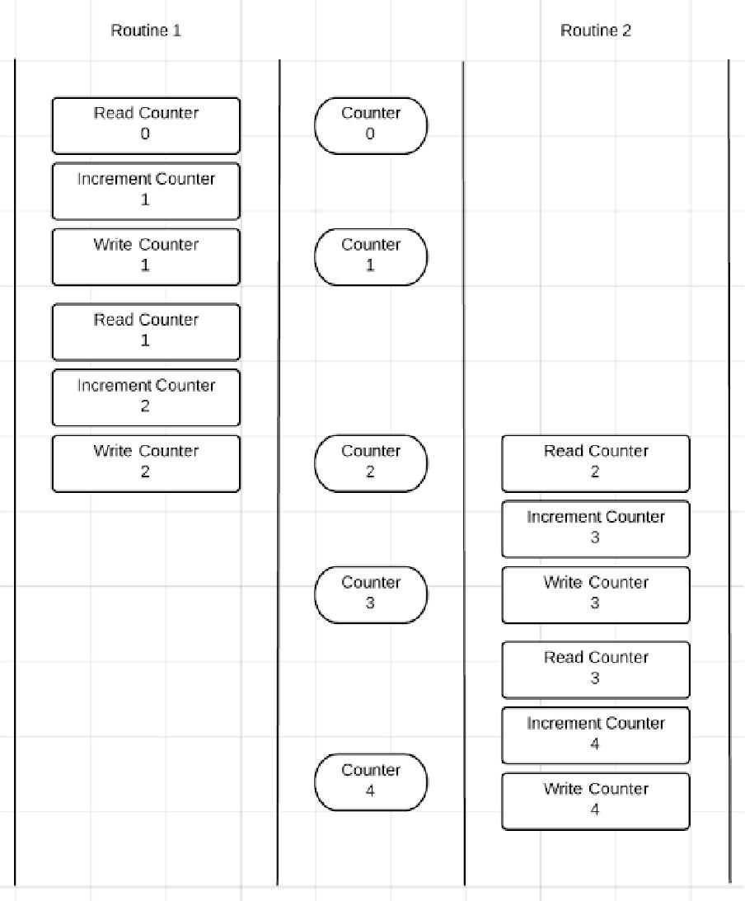

在循环中增加了一个纳秒的暂停:

```go
package main

import (
	"fmt"
	"sync"
	"time"
)

var Wait sync.WaitGroup
var Counter int = 0

func Routine(id int) {
	for count := 0; count < 2; count++ {
		value := Counter
		time.Sleep(1 * time.Nanosecond)
		value++
		Counter = value
	}
	Wait.Done()
}

func main() {
	for routine := 1; routine <= 2; routine++ {
		Wait.Add(1)
		go Routine(routine)
	}
	Wait.Wait()
	fmt.Printf("最后的Counter:%d\n", Counter)
}
// 最后的Counter:2
```

这个暂停导致运行的两个协程之间进行了一次上下文切换。

使用`go build -race race1.go`，输出以下结果：

```go
==================
WARNING: DATA RACE
Write at 0x000000422e90 by goroutine 7:
  main.Routine()
      D:/myproject/race1.go:17 +0x77

Previous read at 0x000000422e90 by goroutine 8:
  main.Routine()
      D:/myproject/race1.go:14 +0x4e

Goroutine 7 (running) created at:
  main.main()
      D:/myproject/race1.go:25 +0x7c

Goroutine 8 (running) created at:
  main.main()
      D:/myproject/race1.go:25 +0x7c
==================
最后的Counter:2
```

试图通过 i++ 方式来解决原子赋值的问题，但是我们通过查看底层汇编:

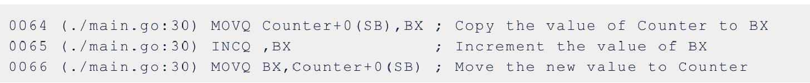

当改为`Counter = Counter + 1` ，使用竞态检测依然存在竞争条件

实际上有三行汇编代码在执行以增加计数器。这三行汇编代码看起来很像原始的 Go 代码。在这三行汇编代码之后可能有一个上下文切换。尽管程序现在正在运行，但从技术上讲，这个 bug 仍然存在。我们的 Go 代码看起来像是在安全地访问资源，而实际上底层的程序集代码根本就不安全。

**我们应该使用 Go 同步语义: Mutex、Atomic**

```go
package main

import (
	"fmt"
	"sync"
)

var Wait sync.WaitGroup
var Counter int = 0
var mu sync.Mutex

func Routine(id int) {
	for count := 0; count < 2; count++ {
		mu.Lock()
		value := Counter
		value++
		Counter = value
		mu.Unlock()
	}
	Wait.Done()
}

func main() {
	for routine := 1; routine <= 2; routine++ {
		Wait.Add(1)
		go Routine(routine)
	}
	Wait.Wait()
	fmt.Printf("最后的Counter:%d\n", Counter)
}
// 最后的Counter:4
```

运行`go run race3.go`输出：最后的Counter:4

另一个例子：

我们第一感觉是 single machine word  应该是原子赋值，为啥 -race 会乱报。我们执行这个代码看看会发生什么。

```go
package main

import "fmt"

type IceCreamMaker interface {
	Hello()
}
type Ben struct {
	id   int
	name string
}

func (b *Ben) Hello() {
	fmt.Printf("Ben says,hello my name is %s\n", b.name)
}

type Jerry struct {
	name string
}

func (j *Jerry) Hello() {
	fmt.Printf("Jerry says,hello my name is %s\n", j.name)
}

func main() {
	var ben = &Ben{id: 20, name: "Ben"}
	var jerry = &Jerry{name: "Jerry"}
	var maker IceCreamMaker = ben
	var loop0, loop1 func()
	loop0 = func() {
		maker = ben
		go loop1()
	}
	loop1 = func() {
		maker = jerry
		go loop0()
	}
	go loop0()
	for {
		maker.Hello()
	}

}

/*

Ben says,hello my name is Ben
panic: runtime error: invalid memory address or nil pointer dereference
[signal 0xc0000005 code=0x0 addr=0x14 pc=0xbc7113]

*/

```

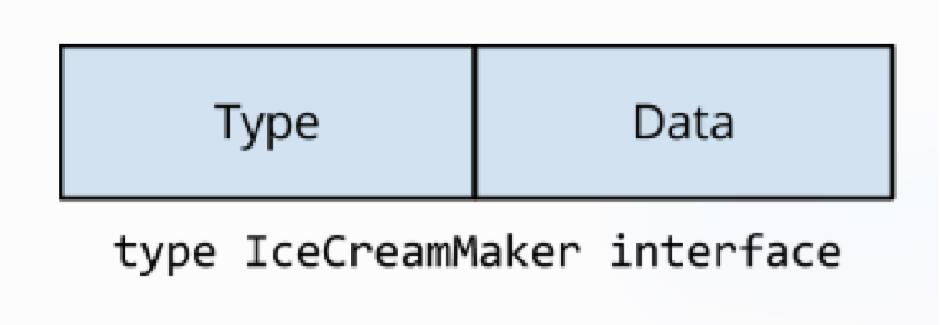

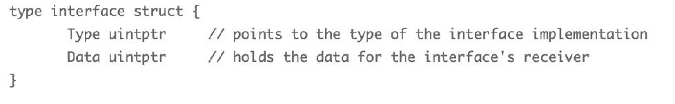

Type 指向实现了接口的 struct，Data 指向了实际的值。Data 作为通过 interface 中任何方法调用的接收方传递。

对于语句 var maker IceCreamMaker=ben，编译器将生成执行以下操作的代码。

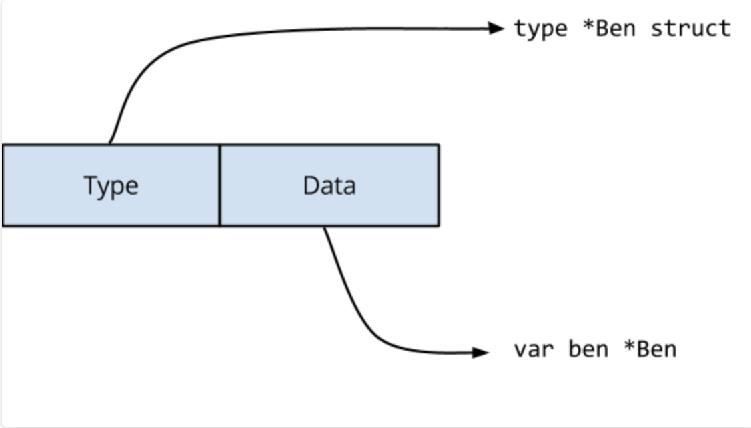

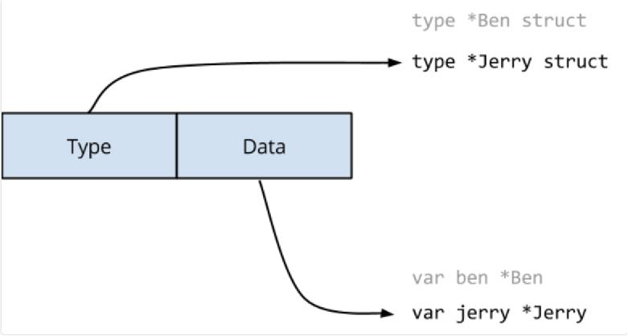

Go memory model 提到过: 表示写入单个 machine word 将是原子的，但 interface 内部是是两个 machine word 的值。另一个goroutine 可能在更改接口值时观察到它的内容。

在这个例子中，Ben 和 Jerry 内存结构布局是相同的，因此它们在某种意义上是兼容的。想象一下，如果他们有不同的内存布局会发生什么混乱？

如果是一个普通的指针、map、slice 可以安全的更新吗？

没有安全的 data race(safe data race)。您的程序要么没有 data race，要么其操作未定义。

- 原子性
- 可见行

### sync.atomic

cfg 作为包级全局对象，在这个例子中被多个 goroutine 同时访问，因此这里存在 data race，会看到不连续的内存输出。

```go
package main

import (
	"fmt"
	"sync"
)

type Config struct {
	a []int
}

func main() {
	cfg := &Config{}
	go func() {
		i := 0
		for {
			i++
			cfg.a = []int{i, i + 1, i + 2, i + 3, i + 4, i + 5}
		}
	}()
	var wg sync.WaitGroup
	for n := 0; n < 4; n++ {
		wg.Add(1)
		go func() {
			for n := 0; n < 100; n++ {
				fmt.Printf("%v\n", cfg)
			}
			wg.Done()
		}()
	}
	wg.Wait()
}

```

我们想到使用 Go 同步语义解决:

- Mutex
- RWMutex
- Atomic

Benchmark 是出结果真相的真理，即便我们知道可能 Mutex vs Atomic 的情况里，Mutex 相对更重。因为涉及到更多的 goroutine 之间的上下文切换 pack blocking goroutine，以及唤醒。

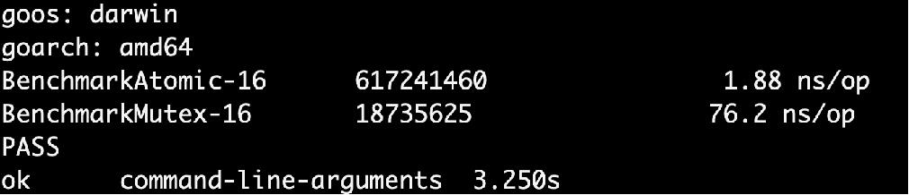

**`go test -bench=.`**

Copy-On-Write 思路在微服务降级或者 local cache 场景中经常使用。写时复制指的是，写操作时候复制全量老数据到一个新的对象中，携带上本次新写的数据，之后利用原子替换（atomic.Value），更新调用者的变量。来完成无锁访问共享数据。

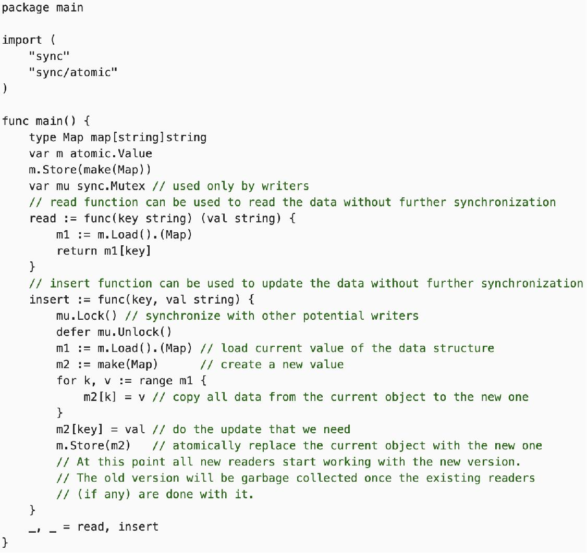

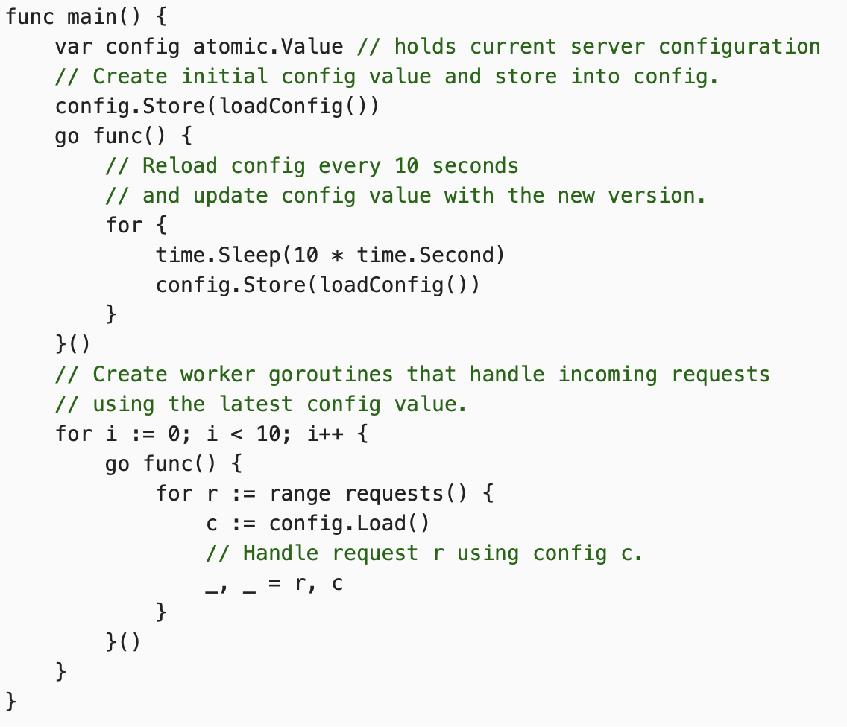


### Mutex

这个案例基于两个 goroutine:

- goroutine 1 持有锁很长时间
- goroutine 2 每100ms 持有一次锁

都是100ms 的周期，但是由于 goroutine 1 不断的请求锁，可预期它会更频繁的持续到锁。我们基于 Go 1.8 循环了10次，下面是锁的请求占用分布:

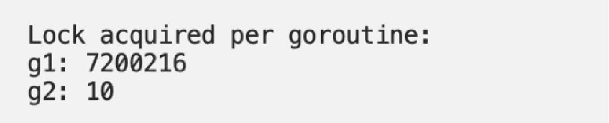

Mutex 被 g1 获取了700多万次，而 g2 只获取了10次。

```go
package main

import (
	"sync"
	"time"
)

func main() {
	done := make(chan bool, 1)
	var mu sync.Mutex
	// groutine1
	go func() {
		for {
			select {
			case <-done:
				return
			default:
				mu.Lock()
				time.Sleep(100 * time.Microsecond)
				mu.Unlock()
			}
		}
	}()
	// groutine2
	for i := 0; i < 10; i++ {
		time.Sleep(100 * time.Microsecond)
		mu.Lock()
		mu.Unlock()
	}
	done <- true
}

```

首先，goroutine1 将获得锁并休眠100ms。当goroutine2 试图获取锁时，它将被添加到锁的队列中- FIFO 顺序，goroutine 将进入等待状态。

然后，当 goroutine1 完成它的工作时，它将释放锁。此版本将通知队列唤醒 goroutine2。goroutine2 将被标记为可运行的，并且正在等待 Go 调度程序在线程上运行。

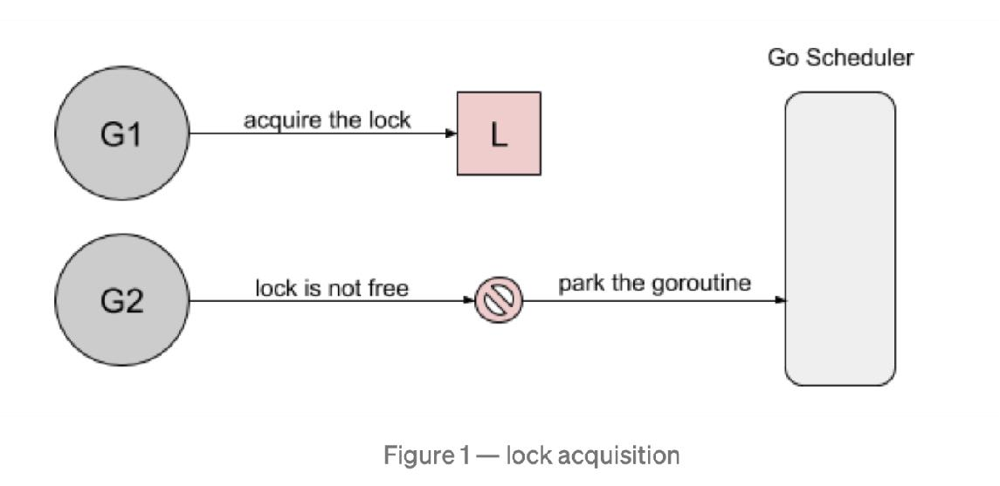

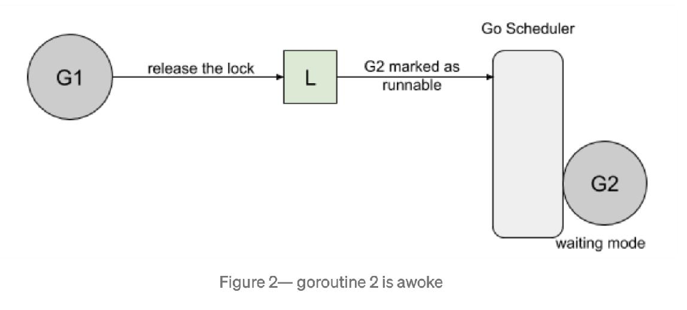

然而，当 goroutine2 等待运行时，goroutine1将再次请求锁。

goroutine2 尝试去获取锁，结果悲剧的发现锁又被人持有了，它自己继续进入到等待模式。

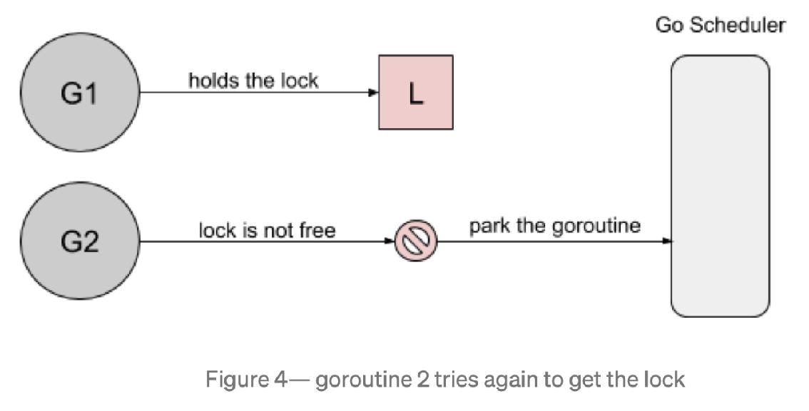

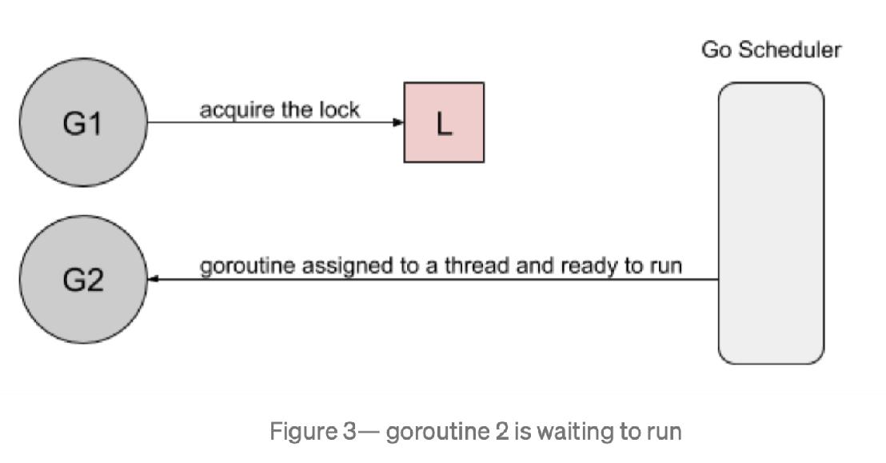

我们看看几种 Mutex 锁的实现:

- Barging. 这种模式是为了提高吞吐量，当锁被释放时，它会唤醒第一个等待者，然后把锁给第一个等待者或者给第一个请求锁的人。
- Handsoff. 当锁释放时候，锁会一直持有直到第一个等待者准备好获取锁。它降低了吞吐量，因为锁被持有，即使另一个 goroutine 准备获取它。
- **一个互斥锁的 handsoff 会完美地平衡两个goroutine 之间的锁分配，但是会降低性能，因为它会迫使第一个 goroutine 等待锁。**
- Spinning. 自旋在等待队列为空或者应用程序重度使用锁时效果不错。parking 和 unparking goroutines 有不低的性能成本开销，相比自旋来说要慢得多。

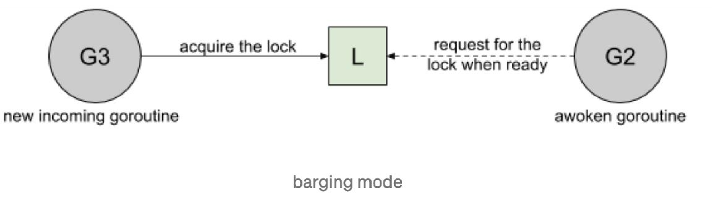

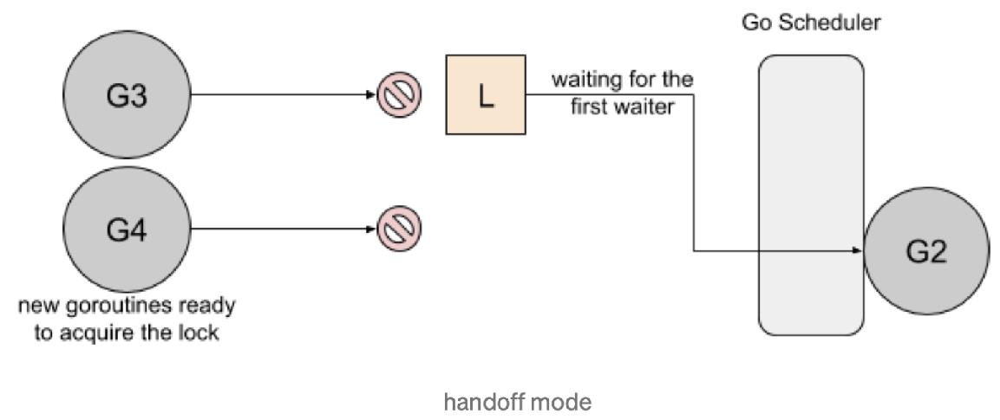

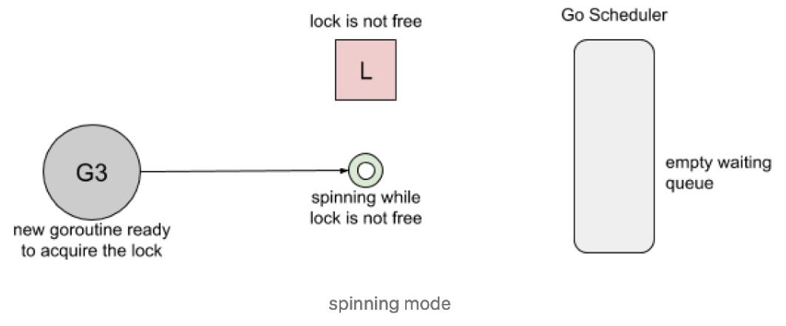

Go 1.8 使用了 Barging 和 Spining 的结合实现。当试图获取已经被持有的锁时，如果本地队列为空并且 P 的数量大于1，goroutine 将自旋几次（用一个 P 旋转会阻塞程序）。自旋后，goroutine park。在程序高频使用锁的情况下，它充当了一个快速路径。

Go 1.9 通过添加一个新的饥饿模式来解决先前解释的问题，该模式将会在释放时候触发 handsoff。所有等待锁超过一毫秒的 goroutine（也称为有界等待）将被诊断为饥饿。当被标记为饥饿状态时，unlock 方法会 handsoff 把锁直接扔给第一个等待者。

在饥饿模式下，自旋也被停用，因为传入的goroutines 将没有机会获取为下一个等待者保留的锁。

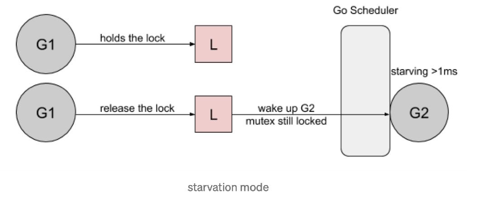

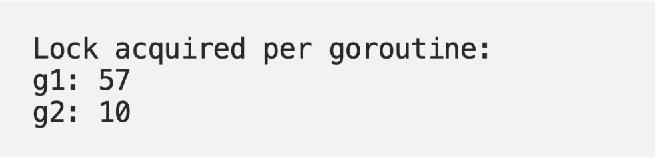

### errgroup

我们把一个复杂的任务，尤其是依赖多个微服务 rpc 需要聚合数据的任务，分解为依赖和并行，依赖的意思为: 需要上游 a 的数据才能访问下游 b 的数据进行组合。但是并行的意思为: 分解为多个小任务并行执行，最终等全部执行完毕。

https://pkg.go.dev/golang.org/x/sync/errgroup

**核心原理: 利用 sync.Waitgroup 管理并行执行的 goroutine。**

- 并行工作流
- 错误处理 或者 优雅降级
- context 传播和取消
- 利用局部变量+闭包

### sync.Pool

sync.Pool 的场景是用来保存和复用临时对象，以减少内存分配，降低 GC 压力（Request-Driven 特别合适）。

Get 返回 Pool 中的任意一个对象。如果 Pool 为空，则调用 New 返回一个新创建的对象。

放进 Pool 中的对象，会在说不准什么时候被回收掉。所以如果事先 Put 进去 100 个对象，下次 Get 的时候发现 Pool 是空也是有可能的。不过这个特性的一个好处就在于不用担心 Pool 会一直增长，因为 Go 已经帮你在 Pool 中做了回收机制。

这个清理过程是在每次垃圾回收之前做的。之前每次GC 时都会清空 pool，而在1.13版本中引入了 victim cache，会将 pool 内数据拷贝一份，避免 GC 将其清空，即使没有引用的内容也可以保留最多两轮 GC。

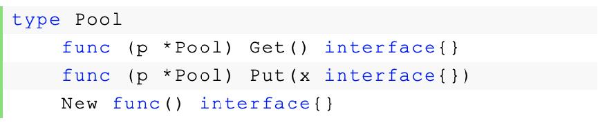

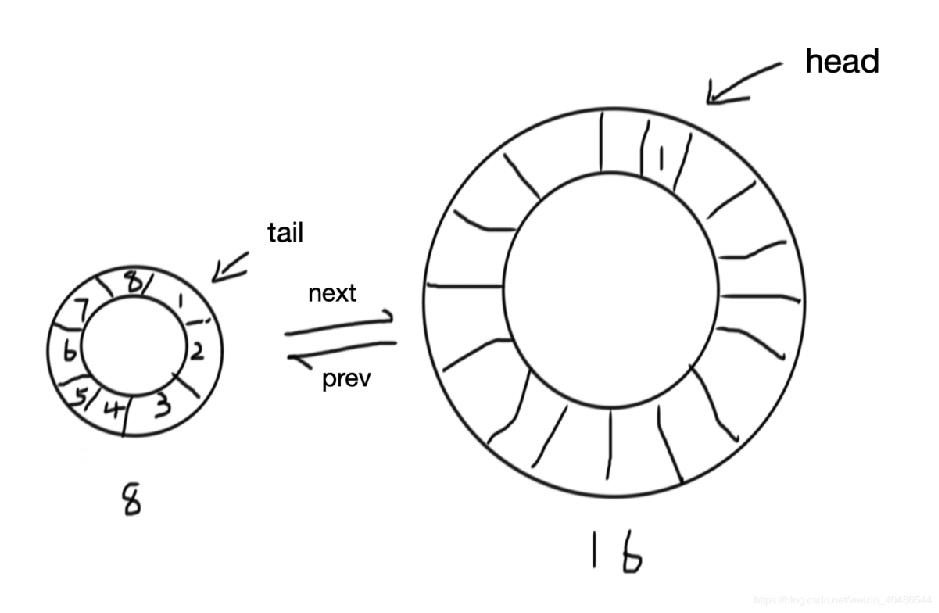

ring buffer（定长 FIFO） + 双向链表的方式，头部只能写入，尾部可以并发读取

## chan

channels 是一种类型安全的消息队列，充当两个 goroutine 之间的管道，将通过它同步的进行任意资源的交换。chan 控制 goroutines 交互的能力从而创建了 Go 同步机制。当创建的 chan 没有容量时，称为无缓冲通道。反过来，使用容量创建的 chan 称为缓冲通道。

要了解通过 chan 交互的 goroutine 的同步行为是什么，我们需要知道通道的类型和状态。根据我们使用的是无缓冲通道还是缓冲通道，场景会有所不同，所以让我们单独讨论每个场景。

### Unbuffered Channels 无缓冲通道

无缓冲 chan 没有容量，因此进行任何交换前需要两个 goroutine 同时准备好。当 goroutine 试图将一个资源发送到一个无缓冲的通道并且没有goroutine 等待接收该资源时，该通道将锁住发送 goroutine 并使其等待。当 goroutine 尝试从无缓冲通道接收，并且没有 goroutine 等待发送资源时，该通道将锁住接收 goroutine 并使其等待。

**无缓冲信道的本质是保证同步**

```go
package main

import (
	"fmt"
	"sync"
	"time"
)

func main() {
	fmt.Println("Start...")
	c := make(chan string)
	var wg sync.WaitGroup
	wg.Add(2)
	go func() {
		defer wg.Done()
		c <- "foo"
	}()
	go func() {
		defer wg.Done()
		time.Sleep(5 * time.Second)
		fmt.Println("Message:" + <-c)
	}()

	wg.Wait()
	fmt.Println("End...")
}

```

https://golang.org/ref/spec#Channel_types

“If the capacity is zero or absent, the channel is unbuffered and communication succeeds only when both a sender and receiver are ready.” 如果容量为零或不存在，则信道无缓冲，只有当发送方和接收方都准备好时，通信才成功

https://golang.org/doc/effective_go.html#channels

“If the channel is unbuffered, the sender blocks until the receiver has received the value” 如果通道未缓冲，发送方将阻塞，直到接收方收到该值

- Receive 先于 Send 发生。
- 好处: 100% 保证能收到。
- 代价: 延迟时间未知。

### Buffered Channels 缓冲通道

buffered channel 具有容量，因此其行为可能有点不同。当 goroutine 试图将资源发送到缓冲通道，而该通道已满时，该通道将锁住 goroutine并使其等待缓冲区可用。如果通道中有空间，发送可以立即进行，goroutine 可以继续。当goroutine 试图从缓冲通道接收数据，而缓冲通道为空时，该通道将锁住 goroutine 并使其等待资源被发送。

```go
package main

import (
	"fmt"
	"sync"
	"time"
)

func main() {
	fmt.Println("Start...")
	// 容量为2的有缓冲通道
	c := make(chan string, 2)
	var wg sync.WaitGroup
	wg.Add(2)
	go func() {
		defer wg.Done()
		c <- "Mario"
		time.Sleep(2 * time.Second)
		c <- "Chompoo"
	}()
	go func() {
		defer wg.Done()
		// time.Sleep(2 * time.Second)
		fmt.Println("Message: " + <-c)
		fmt.Println("Message: " + <-c)
	}()
	wg.Wait()
	fmt.Println("End...")
}

```

### Latencies due to under-sized buffer 缓冲区大小不足导致的延迟

我们在 chan 创建过程中定义的缓冲区大小可能会极大地影响性能。我将使用密集使用 chan 的扇出模式来查看不同缓冲区大小的影响。在我们的基准测试中，一个 producer 将在通道中注入百万个整数元素，而5个 worker 将读取并将它们追加到一个名为 total 的结果变量中。

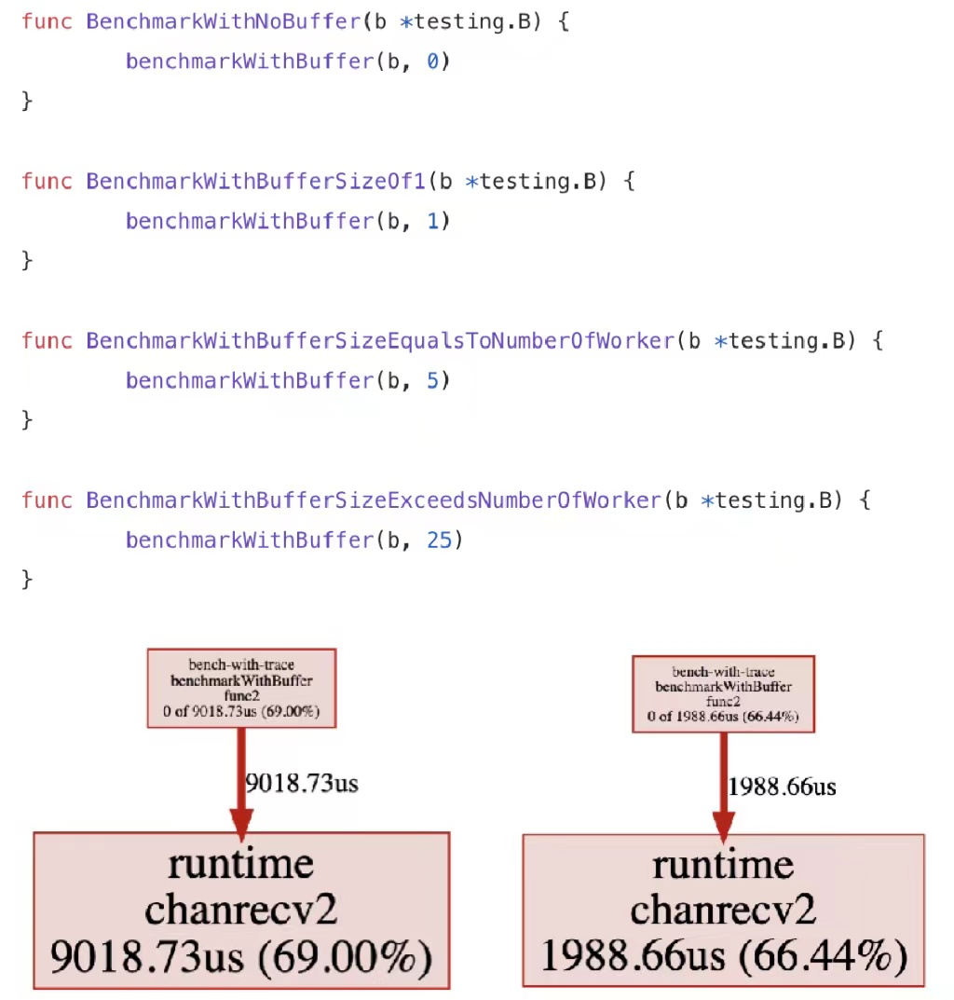

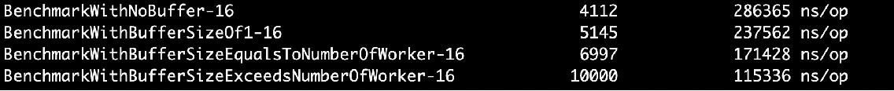

### Go Concurrency Patterns     Go的并发模式

- Timing out
- Moving on
- Pipeline
- Fan-out, Fan-in
- Cancellation
  - Close 先于 Receive 发生（类似 Buffered）。
  - 不需要传递数据，或者传递 nil。
  - 非常适合取消和超时控制。
- Contex

https://blog.golang.org/concurrency-timeouts
https://blog.golang.org/pipelines
https://talks.golang.org/2013/advconc.slide#1
https://github.com/go-kratos/kratos/tree/master/pkg/sync

### Design Philosophy  设计 理念

- **If any given Send on a channel CAN cause the sending goroutine to block:**

  - Not allowed to use a Buffered channel larger than 1.

  - Buffers larger than 1 must have reason/measurements.

  - Must know what happens when the sending goroutine blocks.

    如果信道上的任何给定发送会导致发送goroutine阻塞：
    不允许使用大于1的缓冲通道。
    大于1的缓冲区必须有原因/测量值。
    必须知道当发送goroutine阻塞时会发生什么。

- **If any given Send on a channel WON’T cause the sending goroutine to block:**

  - You have the exact number of buffers for each send.

  - Fan Out pattern

  - You have the buffer measured for max capacity.

  - Drop pattern

    如果信道上的任何给定发送不会导致发送goroutine阻塞：
    您拥有每次发送的确切缓冲区数。
    Fan Out模式
    您已测量了缓冲区的最大容量。
    Drop模式

- **Less is more with buffers.**

  - Don’t think about performance when thinking about buffers.

  - Buffers can help to reduce blocking latency between signaling.

  - Reducing blocking latency towards zero does not necessarily mean better throughput.

  - If a buffer of one is giving you good enough throughput then keep it.

  - Question buffers that are larger than one and measure for size.

  - Find the smallest buffer possible that provides good enough throughput.

    缓冲区越少越好。
    在考虑缓冲区时，不要考虑性能。
    缓冲区可以帮助减少信号之间的阻塞延迟。
    将阻塞延迟减少到零并不一定意味着更好的吞吐量。
    如果一个缓冲区可以提供足够好的吞吐量，那么就保留它。
    询问大于1的缓冲区并测量其大小。
    找到能够提供足够高吞吐量的最小缓冲区。

## Package context   

### Request-scoped context   请求上下文

在 Go 服务中，每个传入的请求都在其自己的goroutine 中处理。请求处理程序通常启动额外的 goroutine 来访问其他后端，如数据库和 RPC 服务。处理请求的 goroutine 通常需要访问特定于请求（request-specific context）的值，例如最终用户的身份、授权令牌和请求的截止日期（deadline）。

当一个请求被取消或超时时，处理该请求的所有 goroutine 都应该快速退出（fail fast），这样系统就可以回收它们正在使用的任何资源。

Go 1.7 引入一个 context 包，它使得跨 API 边界的请求范围元数据、取消信号和截止日期很容易传递给处理请求所涉及的所有 goroutine（显示传递）。

其他语言: Thread Local Storage(TLS)，XXXContext

**核心接口Context**

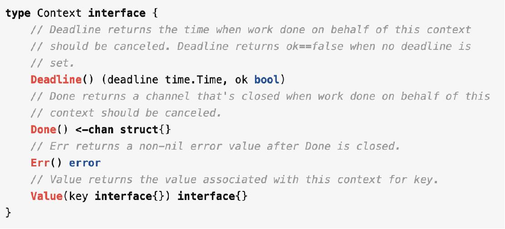

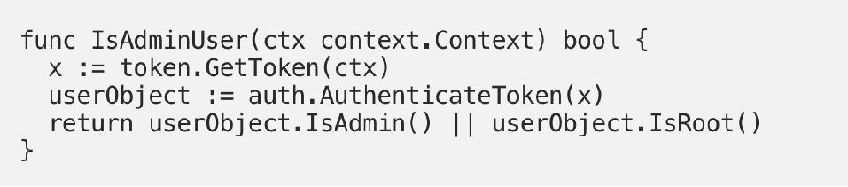

### Request-scoped context 请求上下文

如何将 context 集成到 API 中？

在将 context 集成到 API 中时，要记住的最重要的一点是，它的作用域是请求级别的。例如，沿单个数据库查询存在是有意义的，但沿数据库对象存在则没有意义。

目前有两种方法可以将 context 对象集成到 API 中：

- The first parameter of a function call

  首参数传递 context 对象，比如，参考  net 包 Dialer.DialContext。此函数执行正常的 Dial 操作，但可以通过 context 对象取消函数调用。

- Optional config on a request structure

   在第一个 request 对象中携带一个可选的 context 对象。例如 net/http 库的 Request.WithContext，通过携带给定的 context 对象，返回一个新的 Request 对象。

  ```go
  func (r *Request) WithContext(ctx context.Context) *Request {
  	if ctx == nil {
  		panic("nil context")
  	}
  	r2 := new(Request)
  	*r2 = *r
  	r2.ctx = ctx
  	r2.URL = cloneURL(r.URL) // legacy behavior; TODO: try to remove. Issue 23544
  	return r2
  }
  ```

###Do not store Contexts inside a struct type   不要在结构体类型内存储上下文

Do not store Contexts inside a struct type; instead, pass a Context explicitly to each function that needs it. The Context should be the first parameter, typically named ctx:

不要在结构类型内存储上下文；相反，将上下文显式传递给每个需要它的函数。上下文应该是第一个参数，通常命名为ctx：

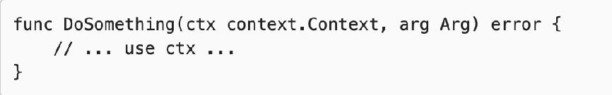

**Incoming requests to a server should create a Context.**  对服务器的传入请求应创建上下文。

使用 context 的一个很好的心智模型是它应该在程序中流动，应该贯穿你的代码。这通常意味着您不希望将其存储在结构体之中。它从一个函数传递到另一个函数，并根据需要进行扩展。理想情况下，每个请求都会创建一个 context 对象，并在请求结束时过期。
不存储上下文的一个例外是，当您需要将它放入一个结构中时，该结构纯粹用作通过通道传递的消息。如下例所示。

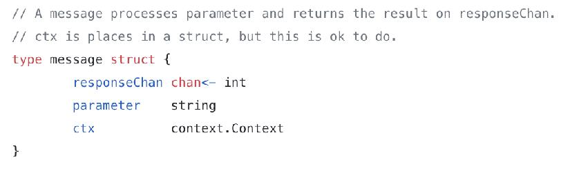

### context.WithValue

context.WithValue 内部基于 valueCtx 实现:

```go
// A valueCtx carries a key-value pair. It implements Value for that key and
// delegates all other calls to the embedded Context.
type valueCtx struct {
	Context
	key, val interface{}
}
```

为了实现不断的 WithValue，构建新的 context，内部在查找 key 时候，使用递归方式不断从当前，从父节点寻找匹配的 key，直到 root context（Backgrond 和 TODO Value 函数会返回 nil）。

```go
func (c *valueCtx) String() string {
	return contextName(c.Context) + ".WithValue(type " +
		reflectlite.TypeOf(c.key).String() +
		", val " + stringify(c.val) + ")"
}

func (c *valueCtx) Value(key interface{}) interface{} {
	if c.key == key {
		return c.val
	}
	return c.Context.Value(key)
}
```

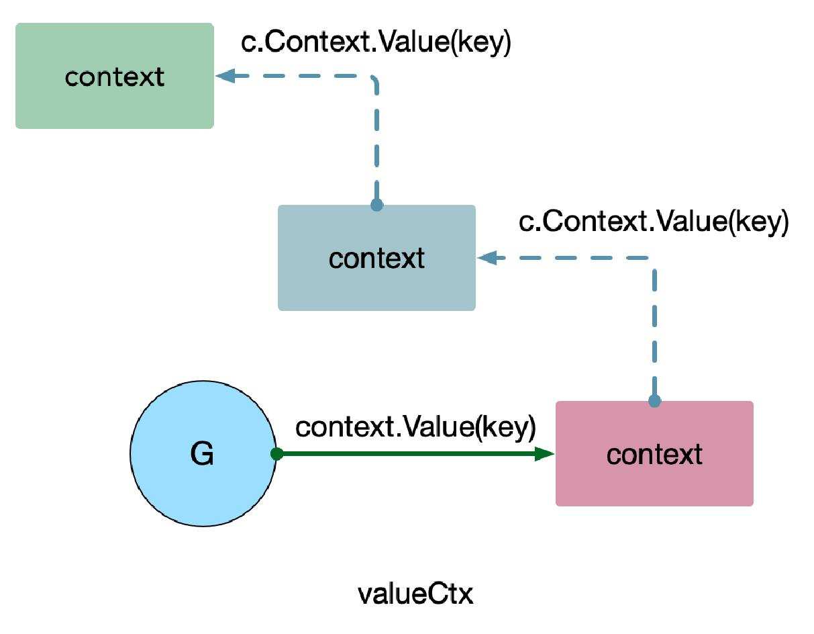

### Debugging or tracing data is safe to pass in a Context 在上下文中传递调试或跟踪数据是安全的

context.WithValue 方法允许上下文携带请求范围的数据。这些数据必须是安全的，以便多个 goroutine 同时使用。这里的数据，更多是面向请求的元数据，不应该作为函数的可选参数来使用（比如 context 里面挂了一个sql.Tx 对象，传递到 data 层使用），因为元数据相对函数参数更加是隐含的，面向请求的。而参数是更加显示的。

```go
func WithValue(parent Context, key, val interface{}) Context {
	if parent == nil {
		panic("cannot create context from nil parent")
	}
	if key == nil {
		panic("nil key")
	}
	if !reflectlite.TypeOf(key).Comparable() {
		panic("key is not comparable")
	}
	return &valueCtx{parent, key, val}
}

// A valueCtx carries a key-value pair. It implements Value for that key and
// delegates all other calls to the embedded Context.
type valueCtx struct {
	Context
	key, val interface{}
}
```

同一个 context 对象可以传递给在不同 goroutine 中运行的函数；上下文对于多个 goroutine 同时使用是安全的。对于值类型最容易犯错的地方，在于 context value 应该是 immutable(不变的) 的，每次重新赋值应该是新的 context，即: **context.WithValue(ctx, oldvalue)**

https://pkg.go.dev/google.golang.org/grpc/metadata
Context.Value should inform, not control（上下文值应该通知，而不是控制）

比如 染色，API 重要性，Trace
https://github.com/go-kratos/kratos/blob/master/pkg/net/metadata/key.go

比如我们新建了一个基于 context.Background() 的 ctx1，携带了一个 map 的数据，map 中包含了 “k1”: “v1” 的一个键值对，ctx1 被两个 goroutine 同时使用作为函数签名传入，如果我们修改了 这个map，会导致另外进行读 context.Value 的 goroutine 和修改 map 的 goroutine，在 map 对象上产生 data race。因此我们要使用 copy-on-write 的思路，解决跨多个 goroutine 使用数据、修改数据的场景。

Replace a Context using WithCancel, WithDeadline, WithTimeout, or WithValue. 使用WithCancel、WithDeadline、WithTimeout或WithValue替换上下文。

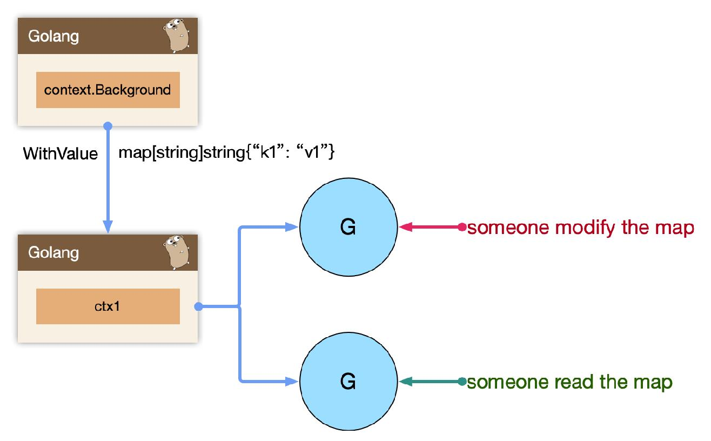


COW: 从 ctx1 中获取 map1（可以理解为 v1 版本的 map 数据）。构建一个新的 map 对象 map2，复制所有 map1 数据，同时追加新的数据 “k2”: “v2” 键值对，使用 context.WithValue 创建新的 ctx2，ctx2 会传递到其他的 goroutine 中。这样各自读取的副本都是自己的数据，写行为追加的数据，在 ctx2 中也能完整读取到，同时也不会污染 ctx1 中的数据。

The chain of function calls between them must propagate the Context.它们之间的函数调用链必须传播上下文。

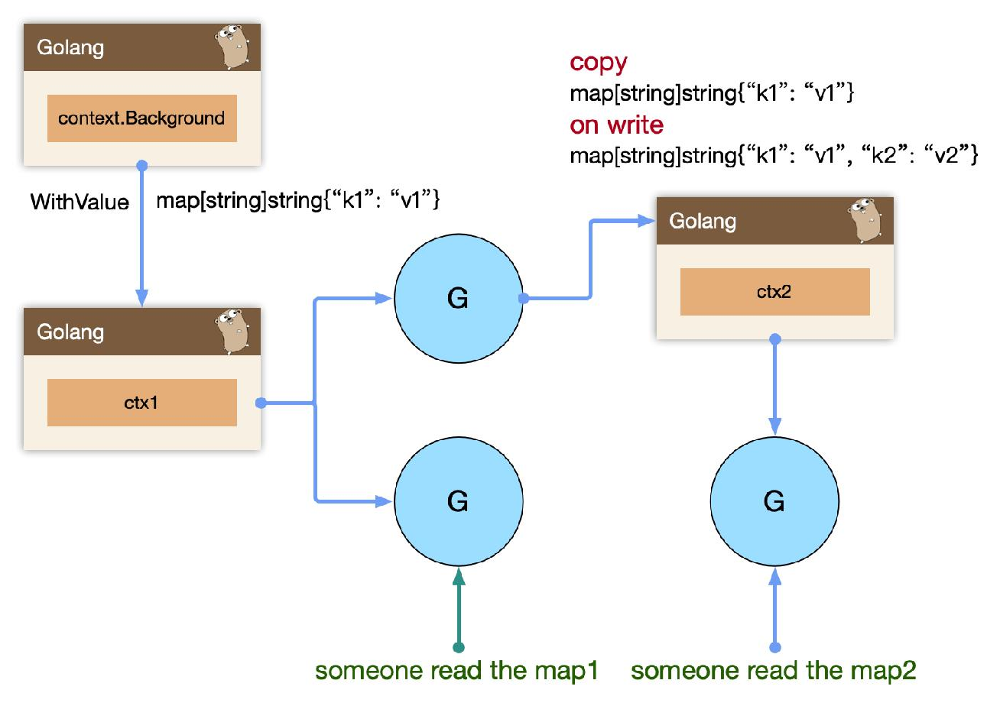

### When a Context is canceled, all Contexts derived from it are also canceled 取消上下文时，从该上下文派生的所有上下文也将被取消

当一个 context 被取消时，从它派生的所有 context 也将被取消。WithCancel(ctx) 参数 ctx 认为是 parent ctx，在内部会进行一个传播关系链的关联。Done() 返回 一个 chan，当我们取消某个parent context, 实际上会递归层层 cancel 掉自己的 child context 的 done chan 从而让整个调用链中所有监听 cancel 的 goroutine 退出。

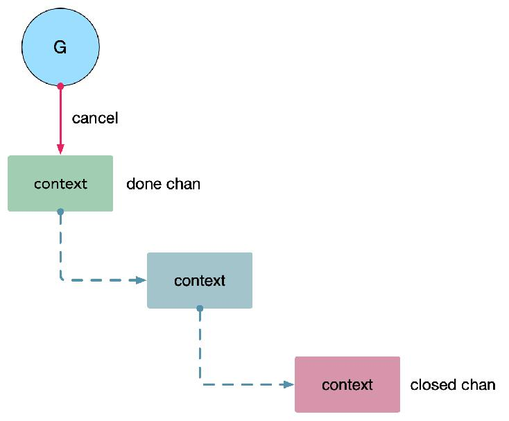

```go
package main

import (
	"context"
	"fmt"
)

func main() {
	gen := func(ctx context.Context) <-chan int {
		dst := make(chan int)
		n := 1
		go func() {
			for {
				select {
				case <-ctx.Done():
					return
				case dst <- n:
					n++
				}
			}
		}()
		return dst
	}
	ctx, cancel := context.WithCancel(context.Background())
	defer cancel()
	for n := range gen(ctx) {
		fmt.Println(n)
		if n == 5 {
			break
		}
	}
}

```

### All blocking/long operations should be cancelable 所有阻塞/长操作都应可取消

如果要实现一个超时控制，通过上面的 context 的 parent/child 机制，其实我们只需要启动一个定时器，然后在超时的时候，直接将当前的 context 给 cancel 掉，就可以实现监听在当前和下层的 context.Done() 的 goroutine 的退出。

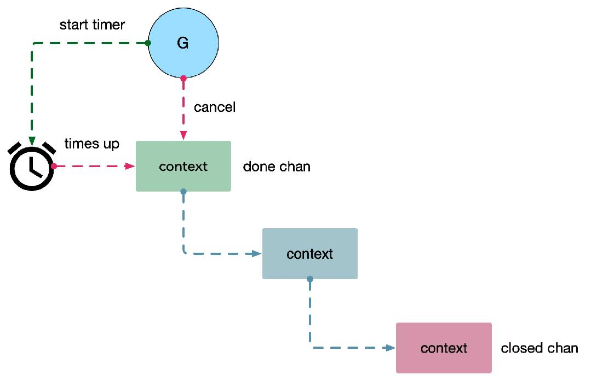

```go
package main

import (
	"context"
	"fmt"
	"time"
)

// const shortDuration = 1 * time.Millisecond
const shortDuration = 2 * time.Second

func main() {
	d := time.Now().Add(shortDuration)
	ctx, cancel := context.WithDeadline(context.Background(), d)

	defer cancel()
	select {
	case <-time.After(1 * time.Second):
		fmt.Println("overslept")
	case <-ctx.Done():
		fmt.Println(ctx.Err())
	}
}

```

## Final Notes

Incoming requests to a server should create a Context.
对服务器的传入请求应创建上下文。

Outgoing calls to servers should accept a Context.
对服务器的传出呼叫应接受上下文。

Do not store Contexts inside a struct type; instead, pass a Context explicitly to each function that needs it.
不要在结构类型内存储上下文；相反，将上下文显式传递给每个需要它的函数。

The chain of function calls between them must propagate the Context.
它们之间的函数调用链必须传播上下文。

Replace a Context using WithCancel, WithDeadline, WithTimeout, or WithValue.
使用WithCancel、WithDeadline、WithTimeout或WithValue替换上下文。

When a Context is canceled, all Contexts derived from it are also canceled.
取消上下文时，从该上下文派生的所有上下文也将被取消。

The same Context may be passed to functions running in different goroutines; Contexts are safe for simultaneous use by multiple goroutines.
相同的上下文可以传递给在不同goroutine中运行的函数；上下文对于多个goroutine同时使用是安全的。

Do not pass a nil Context, even if a function permits it. Pass a TODO context if you are unsure about which Context to use.
即使函数允许，也不要传递nil上下文。如果不确定要使用哪个上下文，请传递TODO上下文。

Use context values only for request-scoped data that transits processes and APIs, not for passing optional parameters to functions.
上下文值仅用于传输进程和API的请求范围数据，而不用于向函数传递可选参数。

All blocking/long operations should be cancelable.
所有阻塞/长操作都应可取消。

Context.Value obscures your program’s flow.
上下文该值模糊了程序的流程。

Context.Value should inform, not control.
上下文值应该是通知，而不是控制。

Try not to use context.Value.
尽量不要使用context.Value。

## References

- https://www.ardanlabs.com/blog/2018/11/goroutine-leaks-the-forgotten-sender.html
- https://www.ardanlabs.com/blog/2019/04/concurrency-trap-2-incomplete-work.html
- https://www.ardanlabs.com/blog/2014/01/concurrency-goroutines-and-gomaxprocs.html
- https://dave.cheney.net/practical-go/presentations/qcon-china.html#_concurrency
- https://golang.org/ref/mem
- https://blog.csdn.net/caoshangpa/article/details/78853919
- https://blog.csdn.net/qcrao/article/details/92759907
- https://cch123.github.io/ooo/
- https://blog.golang.org/codelab-share
- https://dave.cheney.net/2018/01/06/if-aligned-memory-writes-are-atomic-why-do-we-need-the-sync-atomic-package
- http://blog.golang.org/race-detector
- https://dave.cheney.net/2014/06/27/ice-cream-makers-and-data-races
- https://www.ardanlabs.com/blog/2014/06/ice-cream-makers-and-data-races-part-ii.html
- https://medium.com/a-journey-with-go/go-how-to-reduce-lock-contention-with-the-atomic-package-ba3b2664b549
- https://medium.com/a-journey-with-go/go-discovery-of-the-trace-package-e5a821743c3c
- https://medium.com/a-journey-with-go/go-mutex-and-starvation-3f4f4e75ad50
- https://www.ardanlabs.com/blog/2017/10/the-behavior-of-channels.html
- https://medium.com/a-journey-with-go/go-buffered-and-unbuffered-channels-29a107c00268
- https://medium.com/a-journey-with-go/go-ordering-in-select-statements-fd0ff80fd8d6
- https://www.ardanlabs.com/blog/2017/10/the-behavior-of-channels.html
- https://www.ardanlabs.com/blog/2014/02/the-nature-of-channels-in-go.html
- https://www.ardanlabs.com/blog/2013/10/my-channel-select-bug.html
- https://blog.golang.org/io2013-talk-concurrency
- https://blog.golang.org/waza-talk
- https://blog.golang.org/io2012-videos
- https://blog.golang.org/concurrency-timeouts
- https://blog.golang.org/pipelines
- https://www.ardanlabs.com/blog/2014/02/running-queries-concurrently-against.html
- https://blogtitle.github.io/go-advanced-concurrency-patterns-part-3-channels/
- https://www.ardanlabs.com/blog/2013/05/thread-pooling-in-go-programming.html
- https://www.ardanlabs.com/blog/2013/09/pool-go-routines-to-process-task.html
- https://blogtitle.github.io/categories/concurrency/
- https://medium.com/a-journey-with-go/go-context-and-cancellation-by-propagation-7a808bbc889c
- https://blog.golang.org/context
- https://www.ardanlabs.com/blog/2019/09/context-package-semantics-in-go.html
- https://golang.org/ref/spec#Channel_types
- https://drive.google.com/file/d/1nPdvhB0PutEJzdCq5ms6UI58dp50fcAN/view
- https://medium.com/a-journey-with-go/go-context-and-cancellation-by-propagation-7a808bbc889c
- https://blog.golang.org/context
- https://www.ardanlabs.com/blog/2019/09/context-package-semantics-in-go.html
- https://golang.org/doc/effective_go.html#concurrency
- https://zhuanlan.zhihu.com/p/34417106?hmsr=toutiao.io
- https://talks.golang.org/2014/gotham-context.slide#1
- https://medium.com/@cep21/how-to-correctly-use-context-context-in-go-1-7-8f2c0fafdf39
