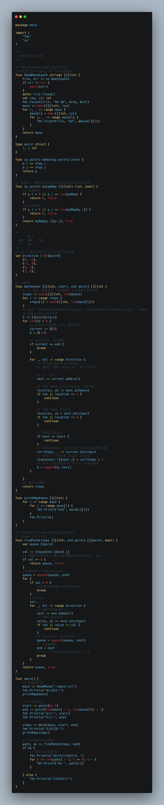

### 介绍

走迷宫是一个经典的算法问题，可以使用广度优先算法，也可以使用深度优先算法。

广度优先算法：先探索周围的每一个点，把周围可走的点添加到队列中，前往周围可走的点，以此类推继续探索，都是点到为止不多走，以保证达到终点时，路径一定是最短的。不需要使用到递归。

深度优先算法：从一个点，一直走到底，走到不能走。需使用递归实现。

本文使用的是广度优先算法实现走迷宫的问题。

### 迷宫

对于迷宫问题，采用程序化的思想，将其抽象成一个 M*N的二维数组，其中0代表可走的，1代表不可走(墙壁)，如下为迷宫文件`maze.ini`：

```ini
6 5
0 1 0 0 0
0 0 0 1 0
0 1 0 1 0
1 1 1 0 0
0 1 0 0 1
0 1 0 0 0
```

注意：`maze.ini`文件的行尾序列需要设置成`LF`，原因在文章后续内容会解释。

### 从配置文件读取迷宫值

`fmt.Fscanf()`

Go语言中的fmt.Fscanf()函数扫描指定的文本，从r中读取，然后将连续的以空格分隔的值存储到由格式确定的连续的参数中。

```go
func Fscanf(r io.Reader, format string, a ...interface{}) (n int, err error)
```

参数：此函数接受三个参数，如下所示：

- r io.Reader：此参数包含扫描的指定文本。

- format string:此参数包含用于接收元素的不同格式。

- a …interface{}:此参数是每个元素的指定变量。

- 返回值：它返回成功解析的项目数。

  

```go
//从配置文件中读取行，列，以及地图规则
func ReadMaze(path string) [][]int {
	file, err := os.Open(path)
	if err != nil {
		panic(err)
	}
	defer file.Close()
	var row, col int
	fmt.Fscanf(file, "%d %d", &row, &col)
	maze := make([][]int, row)
	for i, _ := range maze {
		maze[i] = make([]int, col)
		for j, _ := range maze[i] {
			fmt.Fscanf(file, "%d", &maze[i][j])
		}
	}
	return maze
}
```

关于：`maze.ini` 文件的行尾序列需要设置成`LF`的解释：

windows下创建文件后采用`fmt.Fscanf()`读取数据老是不正确，到换行会读取多一个0，打印输出的内容和文件里的总是不一样，如下：

```go
错误读取的数据：
0  0  1  0  0
0  0  0  0  0
1  0  0  0  1
0  1  0  0  1
1  1  0  0  0
0  1  0  0  1

正确读取的数据：
0  1  0  0  0
0  0  0  1  0
0  1  0  1  0
1  1  1  0  0
0  1  0  0  1
0  1  0  0  0
```

```go
Fscanf的注释：

// Fscanf scans text read from r, storing successive space-separated
// values into successive arguments as determined by the format. It
// returns the number of items successfully parsed.
// Newlines in the input must match newlines in the format.

Fscanf扫描从r读取的文本，将连续的以空格分隔的值存储到由格式确定的连续的参数中。它返回成功解析的项目数。
输入中的换行符必须与format中的换行符匹配。

```

所以猜测是因为文件格式导致的问题，因为CRLF和LF，分别是两种换行符，属于不同的操作系统，一个是\r\n，一个是\n，刚好会多出一个符号。

**LF：换行**：LF（Line Feed）代表“换行”，但你可能更熟悉术语换行符（转义序列 \n）。简单地说，这个字符代表一行文本的结束。在 Linux 和 Mac 上，这相当于新文本行的开始。这种区别很重要，因为 Windows 不遵循此约定。

**CR：回车**：CR（Carriage Return）代表回车（转义序列\r），将光标移动到当前行的开头。

关于CRLF和LF可参考：https://www.mdnice.com/writing/5dcb6caf12db4dcb8a05bfe55dcb044d

后续将文件`maze.ini`的文件的行尾序列改为LF后得到了正确的迷宫数据。

### 走迷宫

文件`maze.go`

接下来，假设起点为(0,0)，终点为其对角线的位置：len(maze) - 1, len(maze[0]) - 1

获取走迷宫的步伐数组：

```go
type point struct {
	i, j int
}

func (p point) add(step point) point {
	p.i += step.i
	p.j += step.j
	return p
}

// 探索点, 判断该点是否越界以及返回该点的值为多少
func (p point) at(myMap [][]int) (int, bool) {
	// 先判断行
	if p.i < 0 || p.i >= len(myMap) {
		return 0, false
	}
	// 再判断列
	if p.j < 0 || p.j >= len(myMap[p.i]) {
		return 0, false
	}
	return myMap[p.i][p.j], true
}

/*
	   0-1
 -10   00    10
	   01
*/
// 每个点都可以进行上下左右四个方向探索
var direction = [4]point{
	{0, -1},
	{-1, 0},
	{0, 1},
	{1, 0},
}

// 走迷宫
func Walk(maze [][]int, start, end point) [][]int {
	// 1、创建一张跟迷宫一样的底图，记录走的步长和路径
	steps := make([][]int, len(maze))
	for i := range steps {
		steps[i] = make([]int, len(maze[i]))
	}
	// 创建一个队列用来存放试探过可以走的点，之后每次循环从该队列中取出点进行下一步探索
	// 并把起点加入该队列中
	Q := []point{start}
	for len(Q) > 0 {
		// 从队列中取出第一个点，进行判断
		current := Q[0]
		Q = Q[1:]

		// 到达终点时，退出循环
		if current == end {
			break
		}

		for _, val := range direction {
			// 对当前点进行四个方向探索
			// 碰到1（墙壁）或者出界了，就不往下执行

			// 下一个点
			next := current.add(val)

			// 判断 next 是否出界或有效（不是墙壁）
			location, ok := next.at(maze)
			if !ok || location == 1 {
				continue
			}

			// 判断 next 是否走过
			location, ok = next.at(steps)
			if !ok || location != 0 {
				continue
			}

			// 判断是否是起点
			if next == start {
				continue
			}
			// 走到这说明这一步是有效的 获取当前位置的步数
			currSteps, _ := current.at(steps)
			// 获取下一步的位置 并让下一步数加1
			steps[next.i][next.j] = currSteps + 1
			// 将下一步添加进队列，用于下一次循环探索
			Q = append(Q, next)
		}

	}
	// 返回步长路径
	return steps
}

```

得到的步伐数组值输出如下：

```go
走迷宫图:
  0  0  4  5  6
  1  2  3  0  7
  2  0  4  0  8
  0  0  0 10  9
  0  0 12 11  0
  0  0 13 12 13
```

**注意：获取steps步伐数组是关键，后续可根据这个数组求解出其他答案**

### 找到通往终点的路径

```go
// 返回通往终点的路径和是否可以找到终点
// steps 步长往回找
func findPath(steps [][]int, end point) ([]point, bool) {
	var queue []point

	val := steps[end.i][end.j]
	// 判断终点的值是否为0 如果为0代表没有找到终点，返回
	if val == 0 {
		return queue, false
	}
	//如果找到了,将终点存入切片
	queue = append(queue, end)
	for {
		if val < 0 {
			//如果该值比0小代表全部找到了
			break
		}
		// 往回找
		val--
		for _, dir := range direction {
			// 继续寻找周围的点
			next := end.add(dir)
			// 判断点是否符合
			value, ok := next.at(steps)
			if !ok || value != val {
				continue
			}
			// 证明点符合，加入队列中
			queue = append(queue, next)
			// 切换end点
			end = next
			// 在一个方向找到后退出继续下一个点
			break
		}
	}
	return queue, true
}
```

最后的`main`函数：

```go
package main

import (
	"fmt"
	"os"
)

func printMap(maze [][]int) {
	for i := range maze {
		for j := range maze[i] {
			fmt.Printf("%3d", maze[i][j])
		}
		fmt.Println()
	}
}

func main() {
	// 读取迷宫值
	maze := ReadMaze("./maze.ini")
	fmt.Println("迷宫路径:")
	printMap(maze)

	// 开始和终点
	start := point{0, 0}
	end := point{len(maze) - 1, len(maze[0]) - 1}
	fmt.Println("起点:", start)
	fmt.Println("终点:", end)

	steps := Walk(maze, start, end)
	fmt.Println("走迷宫图:")
	printMap(steps)

	// 找到通往终点的路径
	path, ok := findPath(steps, end)
	if ok {
		// 从队列末尾取出点
		fmt.Println("通往终点的路径为：")
		for i := len(path) - 1; i >= 0; i-- {
			fmt.Printf("%v ", path[i])
		}

	} else {
		fmt.Println("未找到终点")
	}
}
```

最后运行：`go run maze.go`输出值如下：

```go
迷宫路径:
  0  1  0  0  0
  0  0  0  1  0
  0  1  0  1  0
  1  1  1  0  0
  0  1  0  0  1
  0  1  0  0  0
起点: {0 0}
终点: {5 4}
走迷宫图:
  0  0  4  5  6
  1  2  3  0  7
  2  0  4  0  8
  0  0  0 10  9
  0  0 12 11  0
  0  0 13 12 13
通往终点的路径为：
{0 0} {1 0} {1 1} {1 2} {0 2} {0 3} {0 4} {1 4} {2 4} {3 4} {3 3} {4 3} {5 3} {5 4}
```

最后附上一张完整的代码图：


