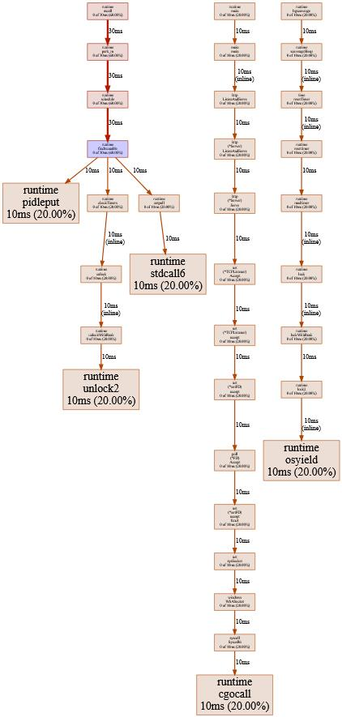
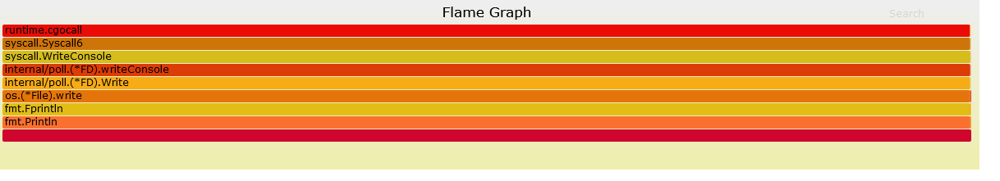

profile就是定时采样，收集cpu，内存等信息，进而给出性能优化指导。

可以通过编译后文件，查看火焰图，查看函数执行时长、内存分析，CPU执行时长。

`main.go`

```go
package main

import (
	"fmt"
	"net/http"
	_ "net/http/pprof"
	"time"
)

// http://localhost:9909/debug/pprof/
func main() {
	go func() {
		i := 0
		for {
			fmt.Println(i)
			i++
			time.Sleep(3 * time.Second)
		}
	}()
	err := http.ListenAndServe(":9909", nil)
	if err != nil {
		panic(err)
	}
}
```

运行：`go run main.go`

访问：`http://localhost:9909/debug/pprof/`，可以看到如下界面：

```go
/debug/pprof/

Types of profiles available:
Count	Profile
3	allocs
0	block
0	cmdline
6	goroutine
3	heap
0	mutex
0	profile
8	threadcreate
0	trace
full goroutine stack dump
Profile Descriptions:

allocs: A sampling of all past memory allocations
block: Stack traces that led to blocking on synchronization primitives
cmdline: The command line invocation of the current program
goroutine: Stack traces of all current goroutines
heap: A sampling of memory allocations of live objects. You can specify the gc GET parameter to run GC before taking the heap sample.
mutex: Stack traces of holders of contended mutexes
profile: CPU profile. You can specify the duration in the seconds GET parameter. After you get the profile file, use the go tool pprof command to investigate the profile.
threadcreate: Stack traces that led to the creation of new OS threads
trace: A trace of execution of the current program. You can specify the duration in the seconds GET parameter. After you get the trace file, use the go tool trace command to investigate the trace.
```

profile就是定时采样，收集cpu，内存等信息，进而给出性能优化指导。

Go 存使用采样，有四个相应的指标：

- inuse_objects：当我们认为内存中的驻留对象过多时，就会关注该指标
- inuse_space：当我们认为应用程序占据的 RSS 过大时，会关注该指标
- alloc_objects：当应用曾经发生过历史上的大量内存分配行为导致 CPU 或内存使用大幅上升时，可能关注该指标
- alloc_space：当应用历史上发生过内存使用大量上升时，会关注该指标

| 类型         | 描述                                                         |
| ------------ | ------------------------------------------------------------ |
| allocs       | 所有过去内存分配的采样信息（所有对象）                       |
| blocks       | 阻塞操作情况的采样信息（用于记录 goroutine 在等待共享资源花费的时间） |
| cmdline      | 当前程序的命令行的完整调用路径goroutine，显示程序启动命令参数及其参数 |
| goroutine    | 显示当前所有协程的堆栈信息                                   |
| heap         | 堆上的内存分配情况的采样信息（活跃对象）                     |
| mutex        | 锁竞争情况的采样信息                                         |
| profile      | cpu占用情况的采样信息，点击会下载文件                        |
| threadcreate | 系统线程创建情况的采样信息                                   |
| trace        | 程序运行跟踪信息                                             |

- /debug/pprof/profile：访问这个链接会自动进行 CPU profiling，持续 30s，并生成一个文件供下载

- /debug/pprof/block：Goroutine阻塞事件的记录。默认每发生一次阻塞事件时取样一次。

- /debug/pprof/goroutines：活跃Goroutine的信息的记录。仅在获取时取样一次。

- /debug/pprof/heap： 堆内存分配情况的记录。默认每分配512K字节时取样一次。

- /debug/pprof/mutex: 查看争用互斥锁的持有者。

- /debug/pprof/threadcreate: 系统线程创建情况的记录。 仅在获取时取样一次。

注意：由于内存分析是取样方式，并且也因为其记录的是分配内存，而不是使用内存。因此使用内存性能分析工具来准确判断程序具体的内存使用是比较困难的。

得到性能数据后，可以使用top、 web、 list等命令快速定位到相应的代码处，然后进行优化。

### pprof可视化界面

执行：`go tool pprof -http=:8080 http://localhost:9909/debug/pprof/profile?seconds=60`，等待一段时间后访问：`http://localhost:8080/ui/`。

显示如下：




### 火焰图

需要安装go-torch工具和brandangregg的火焰图生成脚本：

```go
go get github.com/uber/go-torch
```

然后进入`go-torch`安装目录，安装`FlameGraph`：

```shell
# 目录：D:\myproject\goproject\pkg\mod\github.com\uber\go-torch\
git clone git@github.com:brendangregg/FlameGraph.git
```

然后将目录加入到环境变量Path中：`D:\myproject\goproject\pkg\mod\github.com\uber\go-torch\FlameGraph`

### 下载安装 Perl ，用于执行 .pl 文件

注意：若没安装Perl会报错：

```go
could not generate flame graph
```

下载Perl：链接：https://pan.baidu.com/s/1DzJ_e7wycMApeneymh_OhQ ，提取码：cx2k 

```shell
# 验证是否安装成功
perl -v
```

之后执行：`go-torch --file "torch.svg" --url http://localhost:9909`

会生成一张svg图，浏览器查看：



【火焰图分析】

y 轴表示调用栈，每一层都是一个函数。调用栈越深，火焰就越高，顶部就是正在执行的函数，下方都是它的父函数。

x 轴表示抽样数，如果一个函数在 x 轴占据的宽度越宽，就表示它被抽到的次数多，即执行的时间长。注意，x 轴不代表时间，而是所有的调用栈合并后，按字母顺序排列的。

火焰图就是看顶层的哪个函数占据的宽度最大。只要有"平顶"（plateaus），就表示该函数可能存在性能问题。

颜色没有特殊含义，因为火焰图表示的是 CPU 的繁忙程度，所以一般选择暖色调。

*注意：报错 ERROR: No stack counts found*，是因为程序未被访问，或者没动起来，添加for循环打印输出即可。