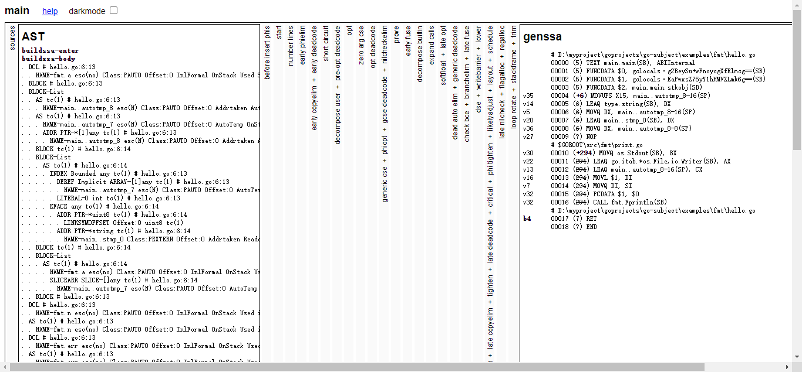

### 关于Go程序是怎么编译的？

这里以hello.go为例子：

```go
package main
import "fmt"
func main() {
	fmt.Println("Hello World!")
}
```

用一个编译指令`go build -n hello.go`来分析，`-n`指令不实际编译它，只是输出它的一个编译的过程。

输出如下：

```shell
#
# command-line-arguments
#

mkdir -p $WORK\b001\
cat >$WORK\b001\importcfg << 'EOF' # internal
# import config
packagefile fmt=D:\mysoft\Go\pkg\windows_amd64\fmt.a
packagefile runtime=D:\mysoft\Go\pkg\windows_amd64\runtime.a
EOF
cd D:\myproject\goprojects\go-subject\examples\fmt
"D:\\mysoft\\Go\\pkg\\tool\\windows_amd64\\compile.exe" -o "$WORK\\b001\\_pkg_.a" -trimpath "$WORK\\b001=>" -p main -complete -buildid DJgdZ89TuzDBJKGoxADM/DJgdZ89TuzDBJKGoxADM -goversion go1.19 -c=4 -nolocalimports -importcfg "$WORK\\b001\\importcfg" -pack "D:\\myproject\\goprojects\\go-subject\\examples\\fmt\\hello.go"
"D:\\mysoft\\Go\\pkg\\tool\\windows_amd64\\buildid.exe" -w "$WORK\\b001\\_pkg_.a" # internal
cat >$WORK\b001\importcfg.link << 'EOF' # internal
packagefile command-line-arguments=$WORK\b001\_pkg_.a
packagefile fmt=D:\mysoft\Go\pkg\windows_amd64\fmt.a
packagefile runtime=D:\mysoft\Go\pkg\windows_amd64\runtime.a
packagefile errors=D:\mysoft\Go\pkg\windows_amd64\errors.a
packagefile internal/fmtsort=D:\mysoft\Go\pkg\windows_amd64\internal\fmtsort.a
packagefile io=D:\mysoft\Go\pkg\windows_amd64\io.a
packagefile math=D:\mysoft\Go\pkg\windows_amd64\math.a
packagefile os=D:\mysoft\Go\pkg\windows_amd64\os.a
packagefile reflect=D:\mysoft\Go\pkg\windows_amd64\reflect.a
packagefile strconv=D:\mysoft\Go\pkg\windows_amd64\strconv.a
packagefile sync=D:\mysoft\Go\pkg\windows_amd64\sync.a
packagefile unicode/utf8=D:\mysoft\Go\pkg\windows_amd64\unicode\utf8.a
packagefile internal/abi=D:\mysoft\Go\pkg\windows_amd64\internal\abi.a
packagefile internal/bytealg=D:\mysoft\Go\pkg\windows_amd64\internal\bytealg.a
packagefile internal/cpu=D:\mysoft\Go\pkg\windows_amd64\internal\cpu.a
packagefile internal/goarch=D:\mysoft\Go\pkg\windows_amd64\internal\goarch.a
packagefile internal/goexperiment=D:\mysoft\Go\pkg\windows_amd64\internal\goexperiment.a
packagefile internal/goos=D:\mysoft\Go\pkg\windows_amd64\internal\goos.a
packagefile runtime/internal/atomic=D:\mysoft\Go\pkg\windows_amd64\runtime\internal\atomic.a
packagefile runtime/internal/math=D:\mysoft\Go\pkg\windows_amd64\runtime\internal\math.a
packagefile runtime/internal/sys=D:\mysoft\Go\pkg\windows_amd64\runtime\internal\sys.a
packagefile internal/reflectlite=D:\mysoft\Go\pkg\windows_amd64\internal\reflectlite.a
packagefile sort=D:\mysoft\Go\pkg\windows_amd64\sort.a
packagefile math/bits=D:\mysoft\Go\pkg\windows_amd64\math\bits.a
packagefile internal/itoa=D:\mysoft\Go\pkg\windows_amd64\internal\itoa.a
packagefile internal/oserror=D:\mysoft\Go\pkg\windows_amd64\internal\oserror.a
packagefile internal/poll=D:\mysoft\Go\pkg\windows_amd64\internal\poll.a
packagefile internal/syscall/execenv=D:\mysoft\Go\pkg\windows_amd64\internal\syscall\execenv.a
packagefile internal/syscall/windows=D:\mysoft\Go\pkg\windows_amd64\internal\syscall\windows.a
packagefile internal/testlog=D:\mysoft\Go\pkg\windows_amd64\internal\testlog.a
packagefile internal/unsafeheader=D:\mysoft\Go\pkg\windows_amd64\internal\unsafeheader.a
packagefile io/fs=D:\mysoft\Go\pkg\windows_amd64\io\fs.a
packagefile sync/atomic=D:\mysoft\Go\pkg\windows_amd64\sync\atomic.a
packagefile syscall=D:\mysoft\Go\pkg\windows_amd64\syscall.a
packagefile time=D:\mysoft\Go\pkg\windows_amd64\time.a
packagefile unicode/utf16=D:\mysoft\Go\pkg\windows_amd64\unicode\utf16.a
packagefile unicode=D:\mysoft\Go\pkg\windows_amd64\unicode.a
packagefile internal/race=D:\mysoft\Go\pkg\windows_amd64\internal\race.a
packagefile internal/syscall/windows/sysdll=D:\mysoft\Go\pkg\windows_amd64\internal\syscall\windows\sysdll.a
packagefile path=D:\mysoft\Go\pkg\windows_amd64\path.a
packagefile internal/syscall/windows/registry=D:\mysoft\Go\pkg\windows_amd64\internal\syscall\windows\registry.a
modinfo "0w\xaf\f\x92t\b\x02A\xe1\xc1\a\xe6\xd6\x18\xe6path\tcommand-line-arguments\nbuild\t-compiler=gc\nbuild\tCGO_ENABLED=1\nbuild\tCGO_CFLAGS=\nbuild\tCGO_CPPFLAGS=\nbuild\tCGO_CXXFLAGS=\nbuild\tCGO_LDFLAGS=\nbuild\tGOARCH=amd64\nbuild\tGOOS=windows\nbuild\tGOAMD64=v1\n\xf92C1\x86\x18 r\x00\x82B\x10A\x16\xd8\xf2"
EOF
mkdir -p $WORK\b001\exe\
cd .
"D:\\mysoft\\Go\\pkg\\tool\\windows_amd64\\link.exe" -o "$WORK\\b001\\exe\\a.out.exe" -importcfg "$WORK\\b001\\importcfg.link" -buildmode=pie -buildid=kLkJCWhDscf_r-hmNYtC/DJgdZ89TuzDBJKGoxADM/DJgdZ89TuzDBJKGoxADM/kLkJCWhDscf_r-hmNYtC -extld=gcc "$WORK\\b001\\_pkg_.a"
"D:\\mysoft\\Go\\pkg\\tool\\windows_amd64\\buildid.exe" -w "$WORK\\b001\\exe\\a.out.exe" # internal
mv $WORK\b001\exe\a.out.exe hello.exe
```

重点看`# import config`这个地方：

```sh
# import config
packagefile fmt=D:\mysoft\Go\pkg\windows_amd64\fmt.a
packagefile runtime=D:\mysoft\Go\pkg\windows_amd64\runtime.a
```

可以看到引入了`fmt.a`和`runtime.a`，在代码中我们导入了fmt包，runtime则是永远自动地跟随着用户代码一起编译的。

接着可以看到windows平台下的`windows_amd64\\compile.exe`编译程序，它编译的产物就是它下面输出的`.a`文件（机器码），把程序运行过程中需要用到文件都会编译成`.a`文件。

接下来通过`windows_amd64\\link.exe`程序，链接成统一的可执行文件，最后输出`hello.exe`：

```shell
$WORK\b001\exe\a.out.exe hello.exe
```

### Go的编译过程

Go的编译过程主要分为2个过程：编译和链接(最后一个)

Go的编译过程：

1、词法分析 -> 2、句法分析  -> 3、语义分析  -> 4、中间码生成  -> 5、代码优化  -> 6、机器码生成  -> 7、链接

1~6过程生成了一堆`.a`文件，最后通过7链接起来。

### 1、词法分析

- 将源代码编译成Toke
- Token是代码中的最小语义结构。例如 package import func 等都不能再拆分了否则无意义

将代码拆成最小语义结构

### 2、句法分析

- Token序列经过处理，变成语法树，也叫抽象语法树sst

  例如这种树状结构：

  root:

  - package (main)
  - import ("fmt")
  - func (main()):
    - fmt.Println()

### 3、语义分析

- 类型检查
- 类型推断
- 查看类型是否匹配
- 函数调用内联
- 逃逸分析（Go的变量到底是放在堆上还是栈上）

### 4、中间码生成（SSA）

为了处理不同平台的差异，先生成中间代码（SSA）

中间代码可以理解为与平台无关的汇编，

查看SSA代码：

```shell
# windows平台用PowerShell
$env:GOSSAFUNC="main"

# Linux平台
export GOSSAFUNC=main
# 最后执行go build
go build

# 之后会输出ssa.html的存放位置
# dumped SSA to .\ssa.html
```




各栏目可以展开查看。

```shell
genssa
# D:\myproject\goprojects\go-subject\examples\fmt\hello.go
00000 (5) TEXT main.main(SB), ABIInternal
00001 (5) FUNCDATA $0, gclocals·g2BeySu+wFnoycgXfElmcg==(SB)
00002 (5) FUNCDATA $1, gclocals·EaPwxsZ75yY1hHMVZLmk6g==(SB)
00003 (5) FUNCDATA $2, main.main.stkobj(SB)
v35
00004 (+6) MOVUPS X15, main..autotmp_8-16(SP)
v14
00005 (6) LEAQ type.string(SB), DX
v5
00006 (6) MOVQ DX, main..autotmp_8-16(SP)
v20
00007 (6) LEAQ main..stmp_0(SB), DX
v36
00008 (6) MOVQ DX, main..autotmp_8-8(SP)
v27
00009 (?) NOP
# $GOROOT\src\fmt\print.go
v30
00010 (+294) MOVQ os.Stdout(SB), BX
v22
00011 (294) LEAQ go.itab.*os.File,io.Writer(SB), AX
v13
00012 (294) LEAQ main..autotmp_8-16(SP), CX
v16
00013 (294) MOVL $1, DI
v7
00014 (294) MOVQ DI, SI
v32
00015 (294) PCDATA $1, $0
v32
00016 (294) CALL fmt.Fprintln(SB)
# D:\myproject\goprojects\go-subject\examples\fmt\hello.go
b4
00017 (7) RET
00018 (?) END
```

ssa代码在研究和排查问题是很有用的，例如我们程序运行需要调用`fmt\print.go`的`fmt.Fprintln(SB)`

### 5、代码优化

可能每一步都有代码的优化

### 6、机器码生成

- 将中间码先生成Plan9汇编代码，（把中间码从平台无关的代码变成各个和平台相关的Plan9汇编代码）
- 最后编译成机器码
- 输出机器码为`.a`文件

查看生成的Plan9汇编代码：

`go build -gcflags -S hello.go`

### 7、链接

将各个包进行链接，包括runtime，最后生成`.exe`文件

### 总结：

- 编译前端：1、词法分析 -> 2、句法分析  -> 3、语义分析  

- 编译后端：4、中间码生成  -> 5、代码优化  -> 6、机器码生成 

- 最后：7、链接
