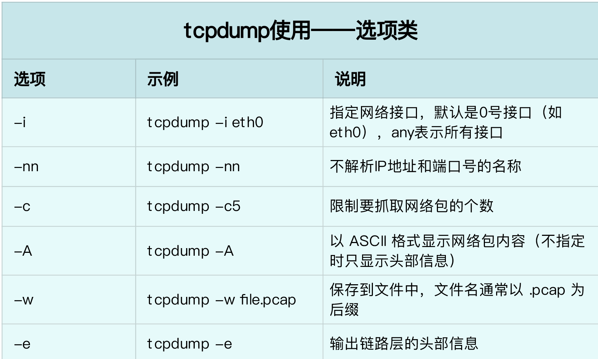
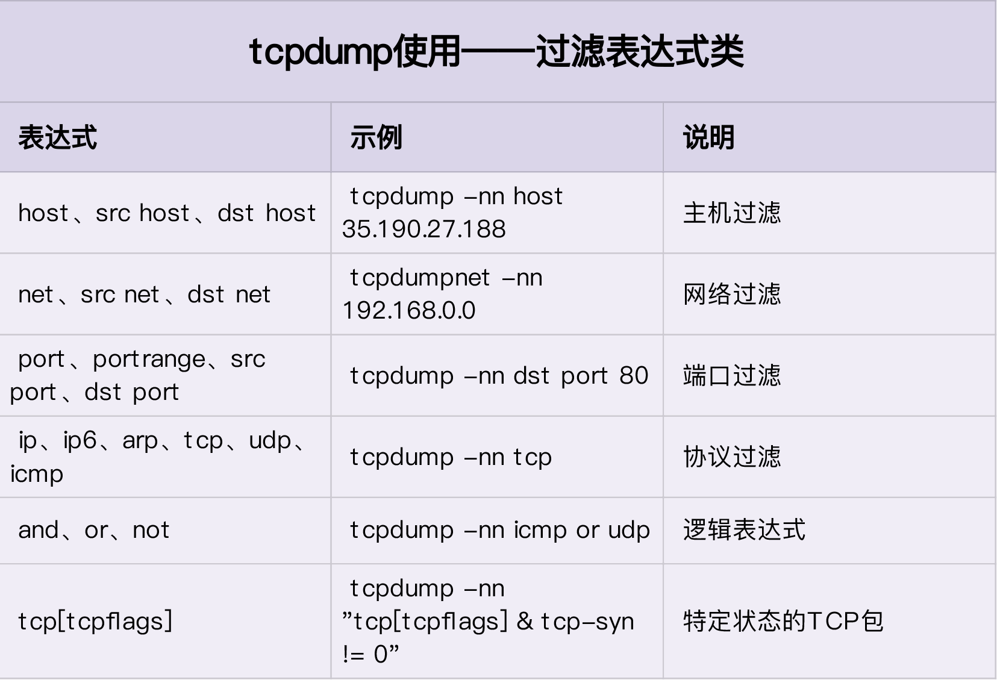
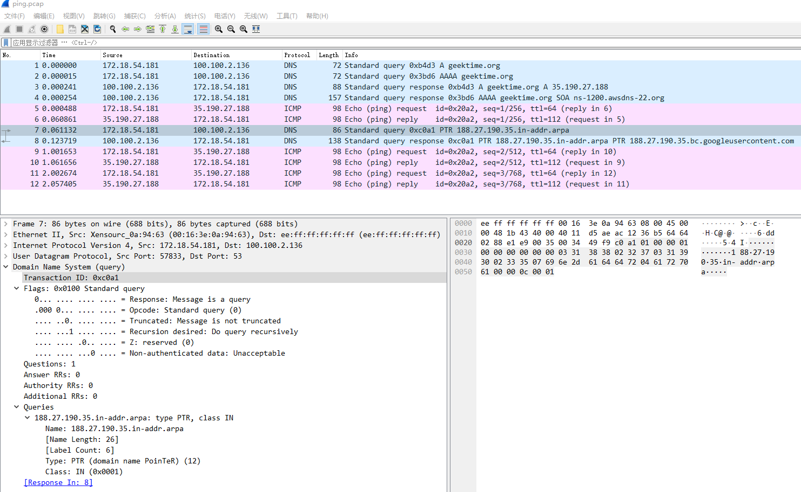
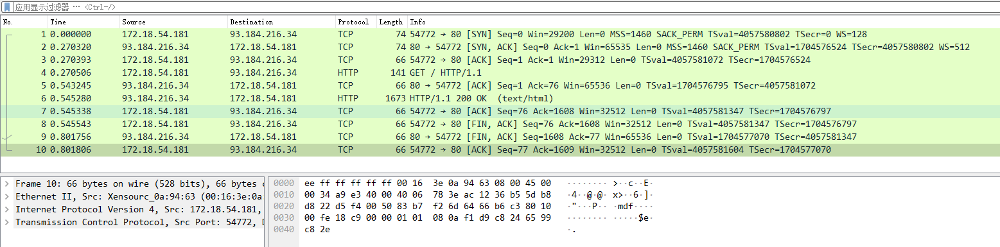
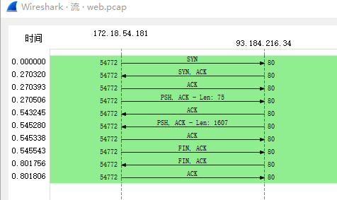
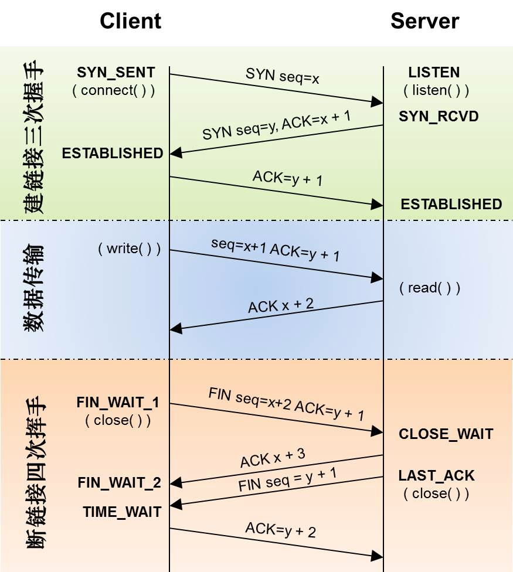

tcpdump 要过滤报文的话，还要依赖一个底层能力：BPF


tcpdump 和 Wireshark 就是最常用的网络抓包和分析工具，更是分析网络性能必不可少的利器。

tcpdump 仅支持命令行格式使用，常用在服务器中抓取和分析网络包。

Wireshark 除了可以抓包外，还提供了强大的图形界面和汇总分析工具，在分析复杂的网络情景时，尤为简单和实用。

### 安装

```shell

# Ubuntu
apt-get install tcpdump wireshark

# CentOS
yum install -y tcpdump wireshark

# 安装Wireshark 的图形界面，以下网址下载安装
https://www.wireshark.org/
```

### tcpdump

tcpdump 可以说是网络性能分析最有效的利器。

tcpdump 也是最常用的一个网络分析工具。它基于 libpcap(https://www.tcpdump.org/)  ，利用内核中的 AF_PACKET 套接字，抓取网络接口中传输的网络包；并提供了强大的过滤规则，帮你从大量的网络包中，挑出最想关注的信息。

使用tcpdump需要对网络协议有了解，网络协议权威资料RFC:https://www.rfc-editor.org/rfc-index.html

对于初学者推荐：《TCP/IP 详解》，特别是第一卷的 TCP/IP 协议族。这是每个程序员都要掌握的核心基础知识。

tcpdump基本使用方法：

- tcpdump [选项] [过滤表达式]
- 选项放在中括号里，就说明这是一个可选选项，需要留意是否有默认值

tcpdump手册：https://www.tcpdump.org/manpages/tcpdump.1.html

pcap-filter手册：https://www.tcpdump.org/manpages/pcap-filter.7.html

####tcpdump常用选项



#### tcpdump常用过滤选项




#### tcpdump输出格式

```shell

时间戳 协议 源地址.源端口 > 目的地址.目的端口 网络包详细信息

#网络包的详细信息取决于协议，不同协议展示的格式也不同。所以，更详细的使用方法，还是需要你去查询 tcpdump 的 man 手册（执行 man tcpdump 也可以查看）

```

tcpdump 的 man 手册：https://www.tcpdump.org/manpages/tcpdump.1.html

**在实际分析网络性能时，先用 tcpdump 抓包，后用 Wireshark 分析，也是一种常用的方法。**

### 案例

```shell
# 执行ping
ping -c3 geektime.org
# 输出
PING geektime.org (35.190.27.188) 56(84) bytes of data.
64 bytes from 188.27.190.35.bc.googleusercontent.com (35.190.27.188): icmp_seq=1 ttl=112 time=52.3 ms
64 bytes from 188.27.190.35.bc.googleusercontent.com (35.190.27.188): icmp_seq=2 ttl=112 time=52.2 ms
64 bytes from 188.27.190.35.bc.googleusercontent.com (35.190.27.188): icmp_seq=3 ttl=112 time=52.8 ms

--- geektime.org ping statistics ---
3 packets transmitted, 3 received, 0% packet loss, time 2003ms
rtt min/avg/max/mdev = 52.210/52.412/52.766/0.251 ms


# 用 tcpdump 抓包，查看 ping 在收发哪些网络包。
# 执行
tcpdump -nn udp port 53 or host 35.190.27.188
# 切换另一个终端执行
ping -c3 geektime.org
# tcpdump输出
dropped privs to tcpdump
tcpdump: verbose output suppressed, use -v or -vv for full protocol decode
listening on eth0, link-type EN10MB (Ethernet), capture size 262144 bytes
12:04:33.908799 IP 172.18.54.181.57171 > 100.100.2.136.53: 9002+ A? geektime.org. (30)
12:04:33.908814 IP 172.18.54.181.57171 > 100.100.2.136.53: 26673+ AAAA? geektime.org. (30)
12:04:33.909159 IP 100.100.2.136.53 > 172.18.54.181.57171: 9002 1/0/0 A 35.190.27.188 (46)
12:04:34.070157 IP 100.100.2.136.53 > 172.18.54.181.57171: 26673 0/1/0 (115)
12:04:34.070634 IP 172.18.54.181 > 35.190.27.188: ICMP echo request, id 49108, seq 1, length 64
12:04:34.122942 IP 35.190.27.188 > 172.18.54.181: ICMP echo reply, id 49108, seq 1, length 64
12:04:34.123298 IP 172.18.54.181.40860 > 100.100.2.136.53: 16139+ PTR? 188.27.190.35.in-addr.arpa. (44)
12:04:34.148669 IP 100.100.2.136.53 > 172.18.54.181.40860: 16139 1/0/0 PTR 188.27.190.35.bc.googleusercontent.com. (96)
12:04:35.071969 IP 172.18.54.181 > 35.190.27.188: ICMP echo request, id 49108, seq 2, length 64
12:04:35.124215 IP 35.190.27.188 > 172.18.54.181: ICMP echo reply, id 49108, seq 2, length 64
12:04:36.073465 IP 172.18.54.181 > 35.190.27.188: ICMP echo request, id 49108, seq 3, length 64
12:04:36.133389 IP 35.190.27.188 > 172.18.54.181: ICMP echo reply, id 49108, seq 3, length 64


#-n 选项禁止名称解析
# 禁止 PTR
ping -n -c3 geektime.org

```

### Wireshark

Wireshark 也是最流行的一个网络分析工具，提供了图形界面。

```shell
# 执行 tcpdump 命令，将结果保存在ping.pcap文件中
$ tcpdump -nn udp port 53 or host 35.190.27.188 -w ping.pcap
```

用`wireshark`打开`.pcap`文件



**查看TCP 三次握手和四次挥手**

```shell

#当你给 dig 命令传一个域名时，默认情况下它会返回该域名的 A 记录 (查询到的站点的 ip 地址)
#+short 查看精简输出
# 执行
dig +short example.com
# 输出
93.184.216.34
# 执行 将结果保存在web.pcap文件中
tcpdump -nn host 93.184.216.34 -w web.pcap
# 也可以执行
tcpdump -nn host example.com -w web.pcap

# 切换终端执行
curl http://example.com

# 按下 Ctrl+C 停止 tcpdump
```

使用`Wireshark`查看web.pcap文件：






**常见的TCP三次握手和四次挥手：**




之所以有三个包，是因为服务器端收到客户端的 FIN 后，服务器端同时也要关闭连接，这样就可以把 ACK 和 FIN 合并到一起发送，节省了一个包，变成了“三次挥手”。

而通常情况下，服务器端收到客户端的 FIN 后，很可能还没发送完数据，所以就会先回复客户端一个 ACK 包。稍等一会儿，完成所有数据包的发送后，才会发送 FIN 包。这也就是四次挥手了。

wireshark文档：https://www.wireshark.org/docs/

wireshark的wiki：https://wiki.wireshark.org/Home

根据 IP 地址反查域名、根据端口号反查协议名称，是很多网络工具默认的行为，而这往往会导致性能工具的工作缓慢
