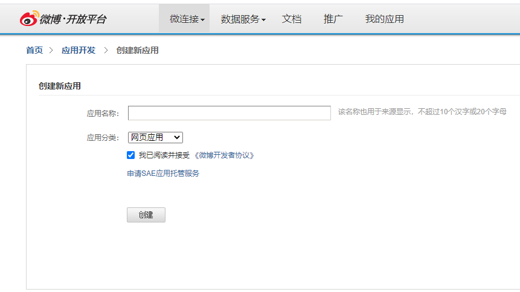
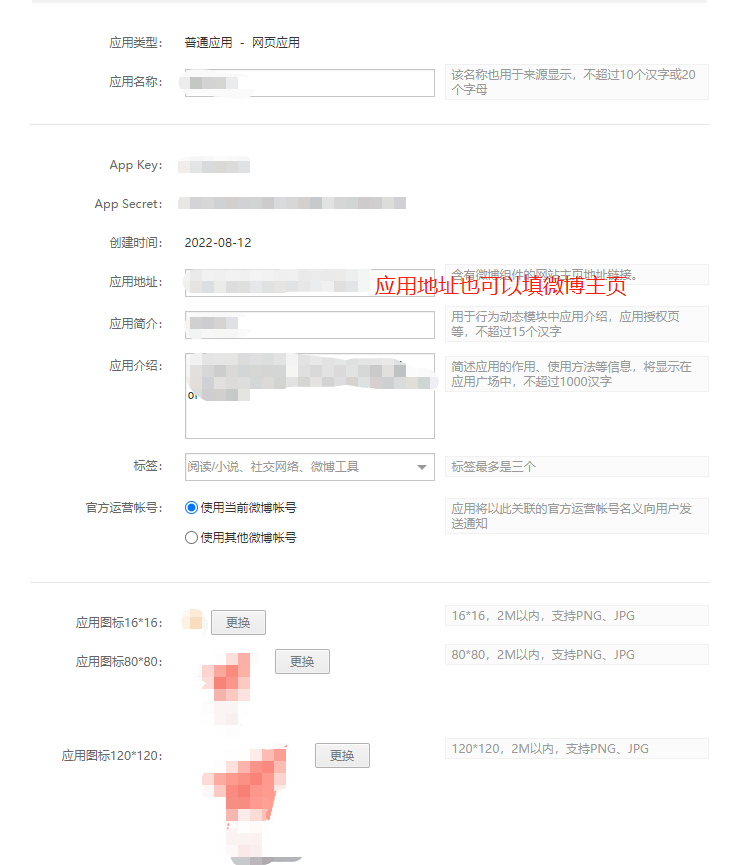
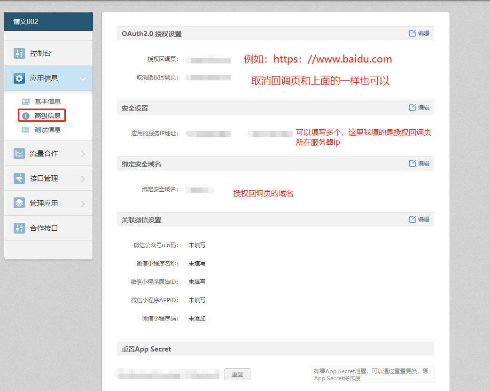
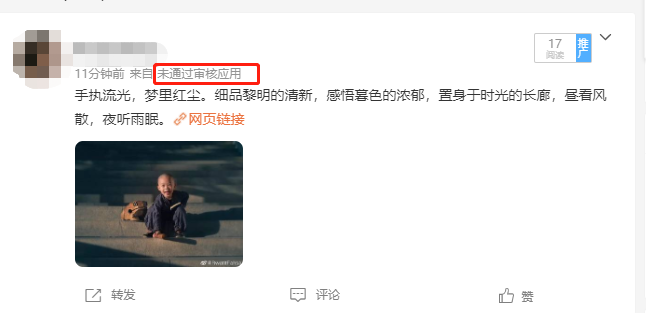

## 微博开放平台创建应用

微博开放平台：https://open.weibo.com/

点击：微连接>网站接入，输入应用名称创建应用。



### 填写应用基本信息



点击左侧高级信息，填写相关内容：



完善信息后提交审核。

###记录应用相关信息

- App Key：XXXX
- App Secret：XXXXXXXXXXXX
- 授权回调页：https://xxx.com
- 应用的服务IP地址：XXXXXXXX


### 获取Code

```python
import requests
try:
    from urllib.parse import urlencode
except ImportError:
    from urllib import urlencode

# App Key
API_KEY = 'xxxxx'
# 授权回调页
REDIRECT_URI = 'xxxxx'
# REDIRECT_URI = 'https://api.weibo.com/oauth2/default.html'

url = 'https://api.weibo.com/oauth2/authorize'

def get_url():
    params = {
        'client_id': API_KEY,
        'redirect_uri': REDIRECT_URI
    }
    return "{0}?{1}".format(url, urlencode(params))


print(get_url())
```

把打印出来的链接粘贴到浏览器上，回车点击授权后重定向到的新链接中出现`code=xxxx`，后面的值即为code值，记录code值后续获取`access_token`需要使用到它。

### 获取access_token

```python
import requests
import json
try:
    from urllib.parse import urlencode
except ImportError:
    from urllib import urlencode

API_KEY = 'XXXX'
API_SECRET = 'XXXXXXXX'
CODE = 'XXXX'
REDIRECT_URI = 'XXXX'

access_token_url = 'https://api.weibo.com/oauth2/access_token'


params = {
    'client_id': API_KEY,
    'client_secret': API_SECRET,
    'grant_type': 'authorization_code',
    'code': CODE,
    'redirect_uri': REDIRECT_URI
}
res = requests.post(access_token_url, data=params)
token = json.loads(res.text)
print(token)

```

执行程序得到以下内容：

```json
{
	'access_token': 'xxxxxxxxxxxxxxxxxxxx',
	'remind_in': '157679999',
	'expires_in': 157679999,
	'uid': '5741349972',
	'isRealName': 'true'
}
```

| 返回值字段   | 字段类型 | 字段说明                                                     |
| :----------- | :------- | :----------------------------------------------------------- |
| access_token | string   | 用户授权的唯一票据，用于调用微博的开放接口，同时也是第三方应用验证微博用户登录的唯一票据，第三方应用应该用该票据和自己应用内的用户建立唯一影射关系，来识别登录状态，不能使用本返回值里的UID字段来做登录识别。 |
| expires_in   | string   | access_token的生命周期，单位是秒数。                         |
| remind_in    | string   | access_token的生命周期（该参数即将废弃，开发者请使用expires_in）。 |
| uid          | string   | 授权用户的UID，本字段只是为了方便开发者，减少一次user/show接口调用而返回的，第三方应用不能用此字段作为用户登录状态的识别，只有access_token才是用户授权的唯一票据。 |

`access_token`长时间有效，拿到之后就可以使用这个去调用发微博的接口了。

### 发微博

图文微博

```python
import requests

access_token = 'xxxxxxxxxxxxx'

url = "https://api.weibo.com/2/statuses/share.json"
# 应用的服务IP地址
rip = "xxxxxxxxxx"
#构建POST参数
params = {
    "access_token": access_token,
    #内容末尾带，后台绑定的安全域名 或 安全域名下的网页
    "status": "手执流光，梦里红尘。细品黎明的清新，感悟暮色的浓郁，置身于时光的长廊，昼看风散，夜听雨眠。https://xxx.com",
    "rip": rip
}
#构建二进制multipart/form-data编码的参数
files={
"pic":open("1.jpg","rb")
}
#POST请求，发表文字+图片微博
res = requests.post(url,data = params, files = files)
print(res.text)

```

运行程序，去微博主页看看是否发布成功。

如果应用还在审核中会有：来自 未通过审核应用。



注：使用该接口发送的博文 后面会带有`网页链接`

### 可能出现的错误

```json
// 检查授权回调页 安全设置 安全域名等配置项 是否正确或未填写
{'error': 'redirect_uri_mismatch', 'error_code': 21322, 'request': '/oauth2/access_token', 'error_uri': '/oauth2/access_token'}

// 检查要发送的内容是否包含链接，因为现在新浪微博强制要求要带链接。
{"error":"text not find domain!","error_code":10017,"request":"/2/statuses/share.json"}

// 参数错误或请求出错
<Response [502]>

```

